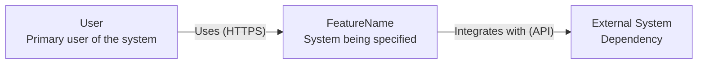
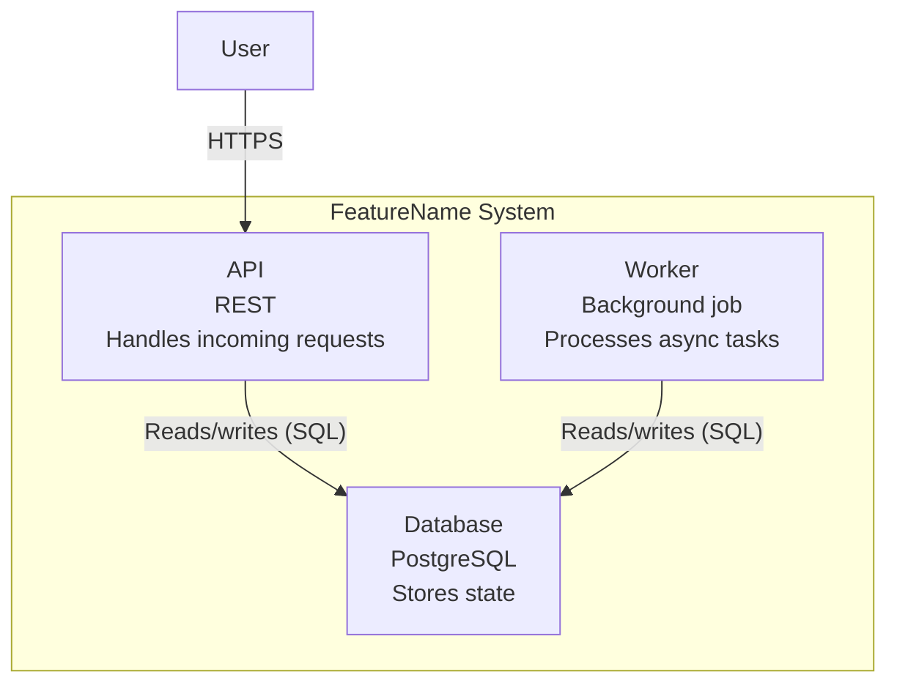

# C4 Model Architecture Design Guidelines

The C4 Model provides a hierarchical decomposition of a software system into System Context, Container, Component, and Code views. This skill generates architecture designs at the SWEBOK v4 Chapter 2/3 level (architecture design stage per Bass/Clements/Kazman), which defines component boundaries, interfaces, interactions, and quality attributes. Per SWEBOK, the architecture design stage establishes the structural envelope within which detailed design operates.

## 1. Scope: Architecture Design vs Detailed Design

SWEBOK v4 divides the design lifecycle into three stages. This skill covers only the first. A separate detailed design step handles the deeper levels.

| Stage | Scope | Who handles it |
| --- | --- | --- |
| Architecture Design | System Context + Container levels (this skill) | spec-to-architecture skill |
| Detailed Design | Component + Code levels (internal module structure) | Separate detailed design step |

## 2. Output Artifacts

The skill generates three files in architecture/:

```
architecture/
  ├── system-context.md     # C4 Level 1: system and its external actors/systems
  ├── container.md          # C4 Level 2: applications, data stores, services
  └── README.md             # Architecture overview and traceability
```

## 3. System Context Diagram (Level 1)

The System Context diagram shows the software system in the center, the users who interact with it, and the external systems it communicates with. Generate this using a Mermaid flowchart diagram.



### 3.1 Extracting Context from BDD

* Person actors: extracted from BDD steps that mention user roles (Given a user... When an admin...). Each distinct role becomes a Person in the diagram.
* External systems: extracted from BDD steps referencing external services (e.g., "When the email service is called", "Given the payment gateway"). These become System_Ext boxes.
* The system itself: named by the feature name from the /specification output directory.

## 4. Container Diagram (Level 2)

The Container diagram zooms in on the system to show the high-level technical containers (applications, databases, microservices, APIs). Generate this using a Mermaid C4Container diagram.



### 4.1 Extracting Containers from BDD

* Containers are derived from the behaviors described in BDD scenarios. Each distinct capability (processing, storing, notifying, etc.) maps to a container candidate.
* Data stores (ContainerDb) are identified from scenarios describing persistence (state changes, resource storage, records).
* Extract container interfaces from BDD action descriptions: inputs in Given clauses, side effects in Then clauses.

## 5. Quality Attribute Mapping

Non-functional requirements identified during /specification are mapped to architectural decisions in the architecture/README.md. Use SWEBOK quality attribute categories.

| Quality Attribute | Architecture Decision |
| --- | --- |
| Performance | Container sizing, caching strategy, async processing |
| Security | Authentication container, authorization boundaries, encryption |
| Reliability | Failover containers, retry logic, deployment observability |
| Scalability | Worker pool sizing, stateless API design |
| Availability | Replica count, health checks, graceful degradation |
| Maintainability | Separation of contracts vs implementation containers |
| Testability | Container interface isolation for mocking |

## 6. SWEBOK Architecture Design Compliance

The architecture output MUST satisfy these SWEBOK v4 Chapter 2/3 principles:

* Abstraction: The architecture shows essential structural elements only, not implementation details.
* Modularization: Containers are separated by well-defined interfaces (Rel edges in C4 diagrams).
* Separation of Concerns: Each container has a single, clearly stated responsibility.
* Verifiability: Container boundaries and interactions map directly to BDD scenarios (traceability).
