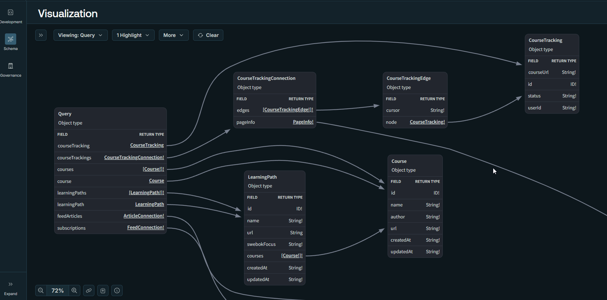
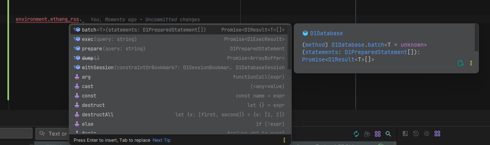
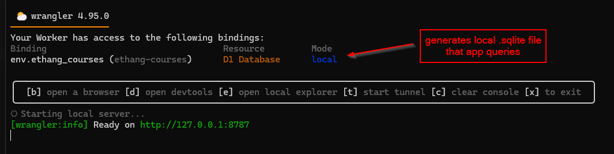
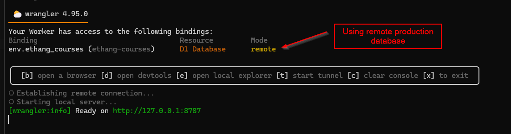
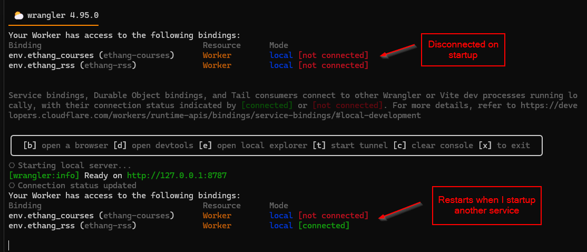
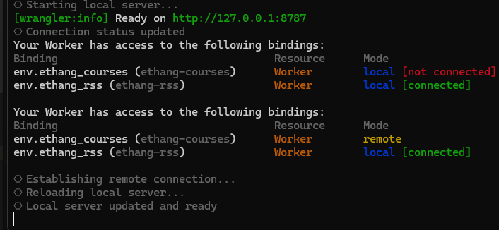
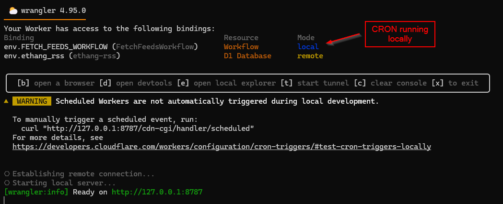
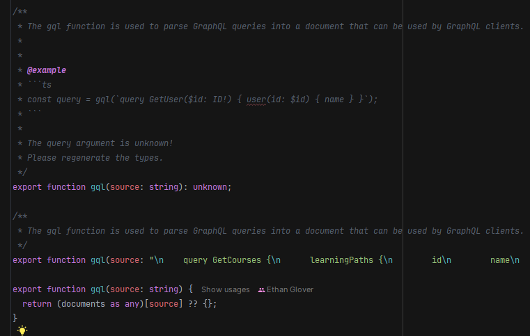
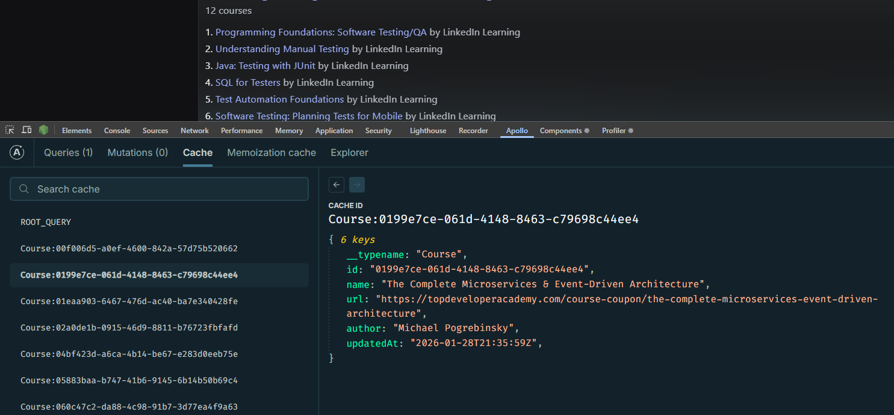

import Blockquote from "../../../components/ui/Blockquote.astro";
import PostImage from "../../../components/ui/PostImage.astro";
import VideoEmbed from "../../../components/ui/VideoEmbed.astro";

I’ve been working on moving my small personal projects to microservices on Cloudflare Workers sitting behind an [Apollo Supergraph](https://www.apollographql.com/blog/the-supergraph-a-new-way-to-think-about-graphql) \(GraphQL Gateway\), and it’s making life so much easier.

This is a project I’ve been putting off for quite some time. I’ve always loved GraphQL and the Apollo ecosystem, but let’s be real—there are always things that make GraphQL feel like complete overengineering.

Schema-first design often feels like redundant work. You have the dreaded N+1 problem. And the types! Oh, the absolute horrors of the types.

There have always been solutions to these things. Code-first schema design took off for a lot of people, but in my opinion, the developer experience of those frameworks has always been awful. I distinctly remember using Prisma ORM and spending weeks trying to solve a single N+1 issue, twisting and rewriting queries as they hit the backend. And sure, type codegen existed, but it was a massive chore. My perfectionist brain would end up doing complex, nested TypeScript `Picks` just to get those generated types exactly right.

Today, though? Things have gotten so much better.

## Cloudflare Service Bindings

First up, using [Service Bindings](https://blog.cloudflare.com/service-bindings-ga/) allow multiple services to talk to one another across a single thread. This makes inter-service communication incredibly cheap and fast.

But maybe more importantly for a solo developer, they work seamlessly in a local environment. When it's time for the API gateway to forward a request to a separate service, it boils down to just a couple of lines of code.

<Blockquote author=" Kabir Sikand" source="Cloudflare" sourceUrl="https://blog.cloudflare.com/service-bindings-ga/">When using Service Bindings, you no longer have to pay for those “idle resources”. With the Workers model, customers can execute work on a single shared compute thread across multiple individual Services, for each and every request. Cloudflare will charge for the amount of time that thread is allocated to your Workers and the time your Workers are awaiting external dependencies. Cloudflare won’t double charge for any overlap.</Blockquote>

`typescript
import isNil from "lodash/isNil.js";

export const ethangCoursesFetcher = async (
  environment: Env,
  request: Request
) => {
  const serviceBinding = environment.ethang_courses;

  if (!isNil(serviceBinding)) {
    return serviceBinding.fetch(request);
  }

  return fetch(request);
}
`

## Apollo Gateway

When we talk about setting up [Apollo Gateway](https://www.apollographql.com/docs/federation/v1/gateway), we no longer need to keep track of multiple public URLs. We just forward the request directly to our service fetcher. Instead of managing a massive, manual configuration block of local ports for every single subgraph, we end up with a very clean, simple abstraction.

Before:

`typescript
const { ApolloGateway, IntrospectAndCompose } = require('@apollo/gateway');

const gateway = new ApolloGateway({
  supergraphSdl: new IntrospectAndCompose({
    subgraphs: [
      { name: 'accounts', url: 'http://localhost:4001' },
      { name: 'products', url: 'http://localhost:4002' },
      // ...additional subgraphs...
    ],
  }),
});
`

After:

``typescript
const gateway = new ApolloGateway({
  buildService: buildService(environment),
  supergraphSdl
});

/* --- */

const parsedUrl = new URL(fetchUrl);
const requestUrl = `https://${name}${parsedUrl.pathname}${parsedUrl.search}`;

const gatewayRequest = new Request(requestUrl, init);

const subgraphFetcher = subgraphs[name];

if (!isNil(subgraphFetcher)) {
  return subgraphFetcher(environment, gatewayRequest);
}

/* --- */

export const subgraphs: Record<
  string,
  (environment: Env, request: Request) => Promise<Response>
> = {
  "ethang-courses": ethangCoursesFetcher,
  "ethang-rss": ethangRssFetcher
};
``

Each service is just a normal [Apollo Server](https://www.apollographql.com/docs/apollo-server). As long as I can point the gateway to a schema file, they get composed into the graph automatically. All of this combines together seamlessly into one unified API.

`yaml
federation_version: =2.0.0
subgraphs:
  ethang-courses:
    schema:
      file: ../ethang-courses/src/graphql/schema.graphql
  ethang-rss:
    schema:
      file: ../ethang-rss/src/graphql/schema.graphql

`

## Drizzle

In terms of syntax and building a schema, [Drizzle](https://orm.drizzle.team/) doesn’t quite match the raw convenience of an ORM like [Prisma](https://www.prisma.io/orm). But the problems with Prisma started with their original Rust engine, which required an executable to run your queries. You can't run separate executables on Cloudflare Workers or any serverless environment.

Eventually, they moved away from this. They finally adopted ESM and dropped the Rust engine... only to end up replacing it with a WASM engine. Forcing Prisma to work with Cloudflare has always been a constant battle, and with every new update, that battle completely renews itself. At a certain point, the conveniences just don’t outweigh the annoyances.

Drizzle, on the other hand, works flawlessly with both Cloudflare D1 and Service Bindings right out of the box.

`typescript
const database = drizzle(environment.ethang_rss, {
  schema: databaseSchema
});
`

Sometimes when you look at these examples, it starts to seem like these “bindings” are just environment strings that point to a URL. But the reality is likely just a hidden `.toString\(\)` method. These bindings are usable to access the services themselves:

## Cloudflare Local Dev

Cloudflare has always offered a superior experience when it comes to working with projects locally. More than just running your app, Cloudflare will actually mock its own services for you in the background and automatically detect local binding dependencies.

With nothing more than a database id and a "remote" boolean flag, you’re either working with a generated mock service on your own file system, or securely connected to a remote one.

`json
"d1_databases": [
  {
    "binding": "ethang_courses",
    "database_id": "7930072d-1d49-4e57-a100-ac95e7916ac7",
    "database_name": "ethang-courses",
    "remote": true
  }
],
`

And when it comes to the gateway, it automagically detects which services are up and when they’re connected. If you flip that remote toggle? It automatically restarts and connects directly to the live, deployed version.

Did I mention it creates local services for you to help simulate a true production environment?

## The Death of Manual Generics

One of the biggest surprises to me while setting this up has been just how good [GraphQL Codegen](https://the-guild.dev/graphql/codegen/docs/getting-started) has become. Previously, it would generate TypeScript types from a GraphQL schema, which was nice—but when you made *specific* queries, you still had to write custom types if you wanted them to be strictly accurate.

``typescript
const badQuery = gql(`
  query Bad {
    learningPaths {
      id
      courses {
        name
      }
    }
  }
`);

const { data } = useApolloQuery<{ learningPaths: LearningPath[] }>(badQuery);

// TypeScript says this is fine.
const woops = data?.learningPaths[0].courses[0].url;
``

If you wanted to solve this problem in the past, you'd end up writing these horrid, heavily-nested types. With any level of complexity, they became real mind-benders and were incredibly difficult to maintain.

``typescript
const badQuery = gql(`
  query Bad {
    learningPaths {
      id
      courses {
        name
      }
    }
  }
`);

type BadQuery = {
  learningPaths: ({
    courses: Pick<Course, "name">[];
  } & Pick<LearningPath, "id">)[];
};

const { data } = useApolloQuery<BadQuery>(badQuery);

// Now url doesn't exist.
const woops = data?.learningPaths[0].courses[0].url;
``

Instead, Codegen came up with something much better: the [documents](https://the-guild.dev/graphql/codegen/docs/config-reference/documents-field)[** **](https://the-guild.dev/graphql/codegen/docs/config-reference/documents-field)[field](https://the-guild.dev/graphql/codegen/docs/config-reference/documents-field). It's an underwhelming name for an incredible power. Instead of making you define unique types for every single query, Codegen scans your frontend files and generates type overloads for the `gql` function automatically.

This in `codegen.yml`:

`yaml
documents:
  - "../../apps/ethang-react/src/**/*.{ts,tsx}"
`

Finds this query:

``typescript
const { data: result, loading } = useApolloQuery(
  gql(`
    query GetCourses {
      learningPaths {
        id
        name
        url
        swebokFocus
        courses {
          id
          name
          url
          author
          updatedAt
        }
      }
    }
  `)
);
``

And creates a type overload for the gql function:

Not only do you skip writing the types yourself, but you don’t even need to pass a generic to the function. Every query gets its own automatic overload. As a nice bonus, it throws an error if you accidentally give two queries the same name, which is perfect for avoiding caching bugs.

## Apollo Client

One could argue that [Apollo Client](https://www.apollographql.com/docs/react) doesn’t come close to comparing to [TanStack Query](https://tanstack.com/query/latest/docs/framework/react/overview), and to a certain degree, that's a fair argument. But when you look at projects like [TanStack DB](https://tanstack.com/db/latest/docs/overview) and start trying to figure out what a "reactive client store for your API" is even supposed to mean, you realize that GraphQL actually had it right from the very start.

Why wrestle REST APIs into a reactive, normalized cache when GraphQL was designed for this exact purpose?

Apollo Client uses GraphQL’s strengths to take individual items—like a list of courses from a single query—and cache them independently. This means if you query an individual course by id later on another page, it just reuses the item it already has. Even better, individual fields you didn't query previously will seamlessly merge into the cache rather than creating duplicate entries. This is exactly what TanStack DB is trying to solve for REST, but the setup is frankly way too much work. You get it out of the box with GraphQL.

## An Ecosystem Rises

This whole stack was extremely easy to put together. Services are created via the [Wrangler CLI](https://developers.cloudflare.com/workers/wrangler/), popped onto the gateway without effort, and frontends can query a single URL to get everything they need through a single session. Caching is normalized, types are perfectly generated based on exactly what's requested, and it all lives happily in a [single monorepo](https://github.com/eglove/ethang-monorepo/).

I don’t often get a full weekend to just sit down and play with code. There are always little convenient services I want to add—a generic CMS, an image service, an email handler. Many of them I’ll likely delete and recreate in a few months, but that’s half the fun. Cloudflare and GraphQL are the kinds of tools that let me solve the exact problems I want to solve, get them out of the way, and keep moving forward to the next cool thing.
