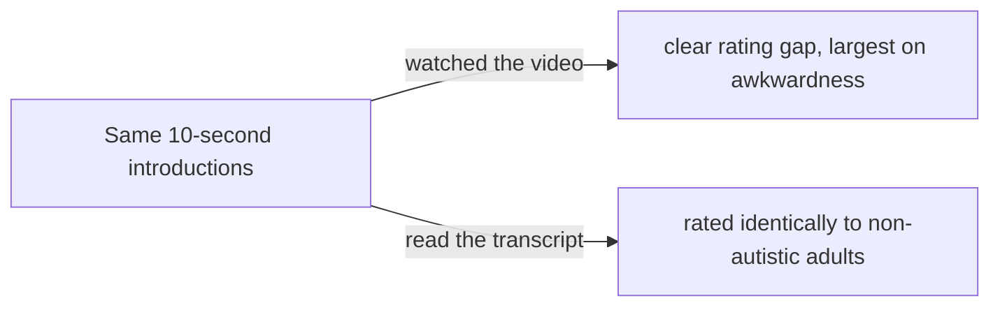
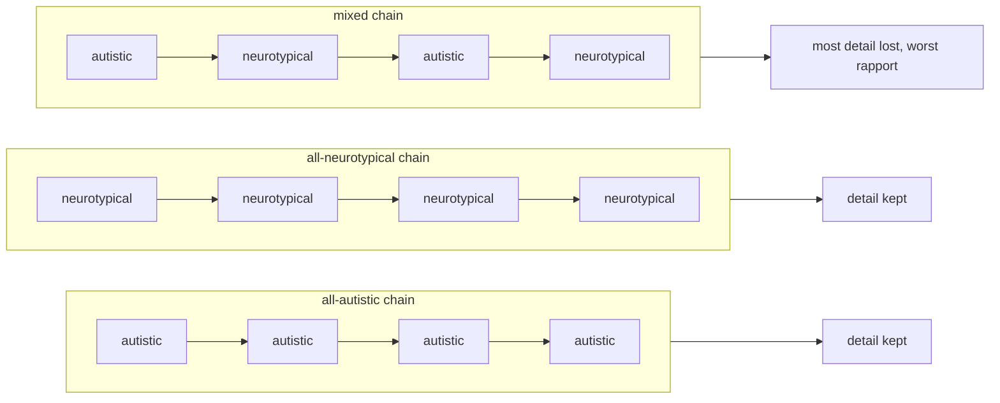
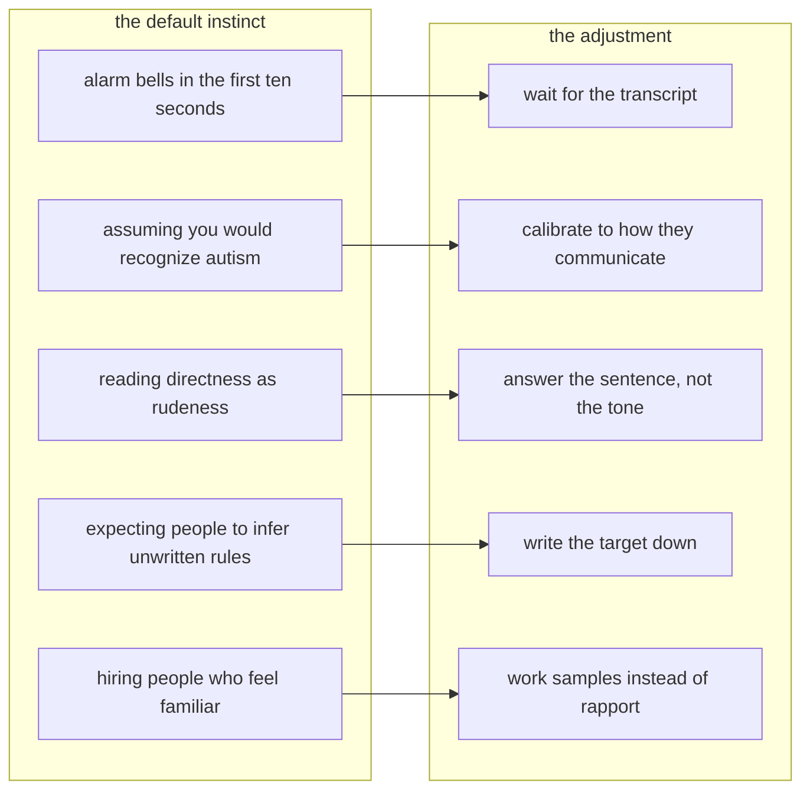
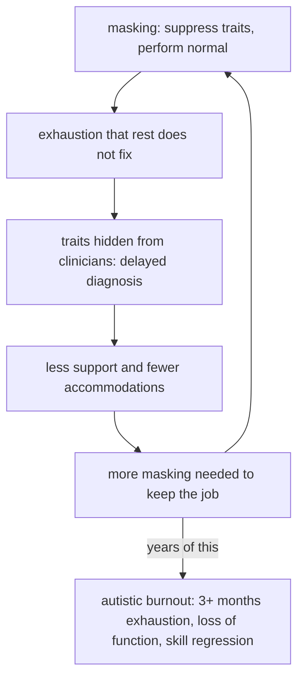

Workplace discrimination against autistic people rarely announces itself, and the people doing it usually don't know they're doing it. It looks like an interview that went cold for a reason nobody wrote down, or a calibration meeting where someone says "not a culture fit," or a reputation for being difficult that formed before the first deliverable even shipped. Ask around afterward and nobody will point to the work, because the work was almost never the thing being judged.

**The barrier is rarely the work.** Autistic employees mostly don't fail at the job itself; they fail at the social environment around it: unwritten rules, shifting expectations, and a verdict that forms before anything they produce is seen. Every part of that is measurable, and every part has a cheap fix that usually doesn't happen.

This post walks through it in order. It starts with what the discrimination looks like up close, with the research attached, because every part of the picture has been measured. Then it covers what coworkers can do to stop applying the penalty, what the penalty costs the people it lands on, and finally the side that gets the least airtime: how autistic workers can dismantle it without pretending to be anyone, which the evidence favors over the mask anyway.

## 1. What the discrimination looks like

Start with something concrete: a new hire's first week. The introductions go politely, but something feels off. Eye contact drifts during the handshake, small talk ends early because it never had anywhere to go, and the answers to casual questions come back more precise than anyone expected. By Friday the team has quietly formed a verdict, and the verdict is usually some version of *awkward*. Notice what that judgment had available to it: no work product at all, because nobody had seen any yet.

That sequence is not speculation; it has been demonstrated directly. In a 2017 study at the University of Texas at Dallas, [214 neurotypical raters watched 10-second clips](https://www.nature.com/articles/srep40700) of autistic and non-autistic adults introducing themselves in a mock audition, matched on age, gender, and IQ, with the raters blind to diagnosis. The autistic people were judged less favorably and rated as people the raters were less willing to sit next to, talk with, or hang out with, and the largest gap was on "awkwardness." Then came the part that matters most: a second group of raters, given transcripts of the same introductions instead of video, rated the two groups identically. Nothing in the content accounted for the penalty, which is why the authors put it plainly: "style, not substance, drives negative impressions of ASD."

<figure className="my-4">

<figcaption>The 2017 thin-slice experiment: the rating gap exists only in the video condition.</figcaption>
</figure>

The effect proved stubborn. It held steady across ten repeated exposures to the same clips, and adults make the same judgment from [2-4 second clips of autistic children](https://www.nature.com/articles/srep40700). Because that finding moves the problem off the autistic person, the authors' own framing is the sentence to remember: social difficulty in autism "may not only be an individual impairment, but also a relational one."

Two follow-ups locate where the verdict actually comes from, and both point away from the person being judged. [Autistic observers watching the same clips didn't apply the penalty at all](https://pmc.ncbi.nlm.nih.gov/articles/PMC8992824/) (DeBrabander et al. 2019). And when researchers tracked what drove the variation in impressions, it turned out to be the characteristics of the rater more than anything happening on screen (Morrison et al. 2019). A first impression of an autistic person, in other words, is less a measurement of the person than a property of the measuring equipment. One more result matters for what comes later: putting an accurate "autism" label on the same clips improved ratings, and raters who knew more about autism rated better still (Sasson and Morrison 2019), because knowledge adjusts the expectations the verdict was running on.

The misreading also runs in both directions, which is the part the deficit model misses. In 2012, Damian Milton, an autistic researcher, [gave it its name](https://doi.org/10.1080/09687599.2012.710008): the double empathy problem. Each group finds the other hard to read, and the wider the gap between how the two see the world, the worse the misreading gets. Differences in neurology may produce differences in sociality, but as Milton put it, that is "not a 'social deficit' as compared to an idealised normative view of social reality."

There is an asymmetry, though, and it comes from population size. Because neurotypical people are the majority, their read wins by default, so when an interaction fails, the explanation gets attached to the autistic person. Milton's sharpest point is what the label does for whoever applies it: locating the problem in the other party absolves the labeler of responsibility for their own perceptions.

If the deficit were real and one-sided, information should degrade fastest when autistic people talk to each other, so [Crompton et al. 2020](https://doi.org/10.1177/1362361320919286) tested exactly that with a telephone-game design: chains of eight people passing a story down the line. All-autistic chains relayed information as well as all-neurotypical chains did. Mixed chains lost the most detail and reported the worst rapport, and the paper's own conclusion is blunt: these results "challenge the diagnostic criterion that autistic people lack the skills to interact successfully." Other work lands in the same place from other angles: typical adults misread autistic nonverbal cues just as badly in the other direction ([Edey et al. 2016](https://doi.org/10.1037/abn0000199)), and misunderstandings between autistic people and their own families run both ways ([Heasman and Gillespie 2018](https://doi.org/10.1177/1362361317708287)).

<figure className="my-4">

<figcaption>Crompton et al. 2020: mixed chains lost the most detail and reported the worst rapport.</figcaption>
</figure>

A lot of the day-to-day friction, then, is a register difference rather than a competence one. In autistic communication, directness is the polite form: you say the thing plainly so the other person actually has it, and autistic community spaces have a saying for it, "clarity is kindness." Most neurotypical workplaces run the opposite code, where the same plainness reads as blunt or worse, and neither side is wrong about its own code. As the autistic creator Orion Kelly [puts it](https://www.youtube.com/watch?v=jIOULwWGaeY): "Autistic people see kindness as honesty. Neurotypical people see honesty as rudeness."

Put the pieces together and the pattern from the opening paragraphs stops being mysterious. The same clarifying question lands as conscientious from one colleague and rude from another because the verdict tracks the speaker rather than the words. Once a first impression is in place, an objection to an unclear requirement reads as a social attack, the person acquires a reputation, and the work they actually produce stops counting against it.

Hiring then formalizes the verdict with a name designed to be unanswerable. "Culture fit" is hiring language for "seems like someone we'd hang out with," and part of its usefulness as a rejection reason is that it has no defined criteria: no paperwork, no argument, no standard anyone can appeal to. The sociologist [Lauren Rivera](https://www.asanet.org/wp-content/uploads/savvy/journals/ASR/Dec12ASRFeature.pdf) embedded with hiring teams at elite investment banks, consultancies, and law firms and found the process runs on cultural matching: evaluators favor candidates who share their leisure interests, self-presentation, and backgrounds, and then treat that similarity as evidence of merit. Rivera's name for the mechanism is [looking-glass merit](https://insight.kellogg.northwestern.edu/article/hirable_like_me), which translates to defining competence in your own image. By the time she took the argument to the [New York Times](https://www.nytimes.com/2015/05/31/opinion/sunday/guess-who-doesnt-fit-in-at-work.html), her conclusion was that "culture fit" had become a socially acceptable way to hire people like the people already in the room: discrimination with better manners.

In 2018, Twilio banned the phrase from its own hiring. [LaFawn Davis](https://web.archive.org/web/20190920075539/https://www.twilio.com/blog/diversity-inclusion-sense-belonging-twilio), then the company's global head of culture and inclusion, put the objection plainly: "Culture fit means nothing. It means 'I don't want to have a beer with you' or 'I don't really know if I like you.' It's not based on skill set. It's not based on anything that has to do with how a candidate would effectively contribute to the company." Twilio's replacement framing was to hire people who add to the culture rather than match it; most of the industry kept the phrase anyway.

The phrase survives because the first-impression research keeps loading it. [Austin and Pisano](https://hbr.org/2017/05/neurodiversity-as-a-competitive-advantage) documented in ["Neurodiversity as a Competitive Advantage"](https://hbr.org/2017/05/neurodiversity-as-a-competitive-advantage) how conventional interviews filter on smooth self-presentation before skills are ever measured, which is why the companies with serious neurodiversity programs ended up redesigning the process instead of the candidates.

Against all of that, the standard escape hatch is masking: if you can perform normal convincingly enough, the penalty stops, or so the theory goes. In practice the performance is exhausting in ways Section 3 documents, and the deeper problem is that it answers a question the penalty was never asking. The research shows the negative judgment was never tracking performance to begin with, which is why better moves exist on both sides of the interaction, and the next section starts with the coworkers.

## 2. What coworkers can do

For neurotypical colleagues and managers, dismantling this penalty comes down to five operational shifts, and none of them needs a budget line, a policy change, or a training seminar. None of it is a list of favors to grant anyone, either. Every move rests on findings already established above, because these are corrections to judgments the research shows were miscalibrated to begin with.

The first move follows directly from the transcript experiment: when the first ten seconds of an interaction set off alarm bells, treat that as information about your own pattern-matching rather than about the other person's competence. The same words, delivered as text, erase the gap entirely, so taking a moment to wait for the substance of what they are saying, rather than how they present it, makes all the difference. It is the difference between rating the person and rating your own reaction.

The second move is calibration, which the label study makes concrete: updating what you expect from someone once you understand how they communicate. A colleague's directness, flat tone, or drifting eye contact is how they come across, not a message about you, and the raters who absorbed that context rated better for it. Reading a little about autism from autistic writers, or simply asking your colleague what works for them, is the whole task.

Third, when feedback arrives without softeners, answer the sentence instead of reacting to the tone. Section 1 covered why the same sentence can land as conscientious from one colleague and rude from another, and why the plain version is the polite form on the sending side. The content is the message; the packaging was never the point.

Fourth, write the target down. The unwritten rules running through Section 1 feel neutral only because the unwritten version already works for you, while an autistic colleague may be spending real mental energy reconstructing what was never said. A written brief, a defined finish line, and decisions with a named owner don't lower a standard; they state it somewhere everyone can read. Software teams formalize this as a Definition of Done on the ticket, and every field has an equivalent. When requirements change mid-stream, that is a new brief rather than a memory test.

Fifth, notice what familiarity is doing during hiring. Section 1 showed that comfort with similar backgrounds and interests gets recorded as merit, and that conventional interviews score smooth self-presentation before any skill is demonstrated. Where you control the process, take Twilio's swap: hire for who adds to the culture rather than who matches it, and measure the work itself with work samples instead of rapport checks. The companies in Austin and Pisano's research made that change and found the candidates their old process screened out.

<figure className="my-4">

<figcaption>The five defaults from this section, and the adjustment each one calls for.</figcaption>
</figure>

Finally, the business case, briefly and with its caveat. Companies that redesigned the process instead of the candidates reported strong results: SAP cites about 90% retention in its Autism at Work program, and JPMorgan has reported participants 90-140% more productive than peers with five to ten years' experience. Those are company-reported numbers, so hold them lightly. The consistent finding across the programs matters more anyway, and it is the same one throughout: the fix is process, not performance.

## 3. What the penalty costs

In aggregate, the penalty shows up in employment statistics that are hard to read any other way. In the UK, [22% of autistic adults](https://www.autism.org.uk/what-we-do/news/new-data-on-the-autism-employment-gap) were in any kind of employment as of 2021, against roughly half of disabled people overall and more than 80% of non-disabled people, and over three-quarters of the unemployed autistic people surveyed said they want to work. The US numbers run the same direction: among young adults who had received special-education services, those with autism had the lowest employment rate of any disability group, with [53.4% ever having worked for pay](https://doi.org/10.1016/j.jaac.2013.05.019) at an average of \$8.10 an hour (Roux et al. 2013). A labor market this selective about style is measuring something other than the work.

Ludmila Praslova compressed the whole subject into a [Harvard Business Review title](https://hbr.org/2021/12/autism-doesnt-hold-people-back-at-work-discrimination-does): "Autism Doesn't Hold People Back at Work. Discrimination Does."

For the individual, the common fix for all of this is masking. [Hull et al.](https://doi.org/10.1007/s10803-017-3166-5) define camouflaging in ["Putting on My Best Normal"](https://doi.org/10.1007/s10803-017-3166-5) as the work of hiding autistic traits and performing neurotypical ones: suppressing stims, forcing eye contact, scripting conversations in advance, studying facial-expression rules explicitly instead of reading them natively, copying other people's mannerisms, and monitoring your own delivery in real time. The survey behind it covered 92 autistic adults, and the motivations split into two groups: assimilation, meaning fit in, avoid bullying and discrimination, and keep jobs; and connection, in one participant's phrase, "to know and be known."

None of that is free. Hull's participants describe exhaustion that only solitude repays: "It's exhausting! I feel the need to seek solitude so I can 'be myself.'" A [2021 follow-up](https://doi.org/10.1186/s13229-021-00421-1) found that camouflaging is a risk factor for anxiety and depression in autistic adults regardless of gender. The starkest numbers come from [Cassidy et al. 2018](https://doi.org/10.1186/s13229-018-0226-4), where camouflaging plus unmet support needs were the risk markers for suicidality unique to autism (cross-sectional data, so risk markers rather than proven causation): 72% of the autistic adults surveyed scored above the recommended psychiatric cut-off for suicide risk, against 33% of the comparison group. Masking also hides the traits clinicians look for, which delays diagnosis, which means less support, which in turn demands more masking. And over the long run, participants describe the deepest cost of all: feeling fake, and not knowing who they are underneath. One of Raymaker's research participants put it in physical terms: long-term masking "leaves behind a kind of psychic plaque in the mental and emotional arteries."

Where years of this lead has a name: autistic burnout. [Raymaker et al. 2020](https://pmc.ncbi.nlm.nih.gov/articles/PMC7313636/) define it as the result of chronic life stress and a mismatch of expectations and abilities without adequate supports, and its markers are pervasive, long-term (typically 3+ months) exhaustion, loss of function, and reduced tolerance to stimulus. It is measurably distinct from occupational burnout or clinical depression, and the most prominent life stressor in the research was masking itself, which participants described as "the need to suppress autistic traits or disability, or pretend to be nonautistic." Severe cases include skill regression, including speech. A Delphi study of autistic experts ([Higgins et al. 2021](https://doi.org/10.1177/13623613211019858)) added a clinical warning worth repeating: psychological treatments aimed at depression can make autistic burnout worse. As for what helped, the participants' answers were acceptance and social support, time off or reduced expectations, and doing things "in an autistic way." The prevention note in the same paper is one sentence long, and it is the sentence this whole section rests on: stop teaching autistic people to mask.

<figure className="my-4">

<figcaption>The masking burnout loop: each pass through the cycle deepens the next, and years of it exits into burnout.</figcaption>
</figure>

The cost side of the ledger, then, reads like this: an environment that makes masking the price of belonging is manufacturing the condition that will eventually remove the employee. The workplace trains the performance, and then it bills the performer.

## 4. Without the mask

For autistic workers navigating these environments, the objective shifts from performing to structuring: arranging your working life so the penalty has fewer places to land, instead of performing your way around it. The tradeoffs start stated honestly rather than as encouragement. Disclosure carries real risk: [Lindsay et al. 2021](https://doi.org/10.1080/09638288.2019.1635658) found both effects in their systematic review (accommodations and awareness on one side, stigma and discrimination on the other), and [Tomas et al. 2023](https://doi.org/10.1007/s10803-022-05766-x) found the decision is individual and context-dependent. Masking, in other words, is expensive even though it is rational. The moves below don't ask you to pretend to be anyone; each one works by taking the rater out of the loop instead of performing for them.

Disclosure can be treated as information rather than confession. In [mock employment interviews](https://pmc.ncbi.nlm.nih.gov/articles/PMC10981196/), candidates who disclosed autism were rated as performing better (Norris et al. 2024), and on the same clips an accurate label improved impressions, with autism knowledge stacking further improvement on top of it. Mechanically, that is what disclosure is: correcting data for the rater. You don't owe anyone a diagnosis, but where you do choose to share it, you are handing over the one variable that measurably changes how the read comes out.

There is also the option of moving the record into the medium where the penalty vanishes. The transcript condition from Section 1 is the most tactically useful finding in this literature: with content held constant, writing rated the groups the same. So follow conversations with recap emails, push decisions into tickets and documents, and send the written summary first rather than as an apology afterward. To everyone else this reads as diligence; for you it moves the evaluation onto the one field where style doesn't score.

Structure can be requested as a work requirement rather than a concession, because the things that dissolve the penalty are cheap by any standard: a written brief, a defined finish line, one source of truth, decisions with a named owner. The [Job Accommodation Network's employer survey](https://askjan.org/topics/costs.cfm) puts real numbers on cheap: 61% of accommodations cost nothing to implement, the median one-time cost was \$300, and only 6% carried ongoing costs. Two-thirds of employers rated them very or extremely effective, and 85% cited retention. Asking for the target in writing doesn't lower it.

It is also worth knowing the floor under you. In the US, the ADA's Title I protects qualified autistic employees at companies with 15 or more workers, and autism is on the [EEOC's list](https://www.eeoc.gov/laws/guidance/questions-and-answers-final-rule-implementing-ada-amendments-act-2008) of impairments that should "easily be concluded" to substantially limit major life activities, which include concentrating, thinking, communicating, and working. A request needs no magic words; "I need X to do my job" is a request. Your employer may ask for reasonable documentation of the limitation, but not your whole medical file. The regulations require an [interactive process](https://www.law.cornell.edu/cfr/text/29/1630.2) to identify accommodations jointly, and [EEOC guidance](https://www.eeoc.gov/laws/guidance/enforcement-guidance-reasonable-accommodation-and-undue-hardship-under-ada) is explicit that unnecessary delays can themselves violate the law. Refusal is lawful only on undue hardship, and demonstrating that burden belongs to the employer rather than to you. One practical habit covers all of it: put your request and their answer in writing, because in any later complaint that record is the whole game.

Unmasking can also happen in increments you choose, and the research on what helps is not subtle: acceptance, support, time, and doing things "in an autistic way." Treated tactically, that might mean stimming through the meeting, keeping the camera off, or asking for the agenda in writing before the discussion rather than reconstructing it from the minutes afterward. Each low-stakes place you stop performing buys you real information: which parts of the room never required the mask, and which colleagues were applying the penalty all along.

Where you have any influence over how you're evaluated, it is worth steering selection toward work samples: a trial task, a portfolio walk, a paired session. A rapport interview is the one arena where the style penalty scores highest and the job counts least, and the companies in Austin and Pisano's research swapped rapport for work samples and found the candidates their old process screened out.

## 5. The rater is the variable

Every result above relocates the same problem, and following that movement is the whole argument. The thin-slice study moved it out of the autistic person and into the judgment formed about them. The double empathy problem turned a one-sided deficit into a two-sided misread. Morrison's follow-up moved what was left onto the rater entirely, because variation in the verdict turned out to be driven more by who's judging than by who's being judged. The research converges on a single point: the rater is the variable, and the rater can change.

Masking runs the opposite direction, because it treats the reading as fixed and rebuilds the person to fit it, all day, at real cost. The healthier shape of a workplace runs the other way: the review points at the standard, the standard was written before the work started, and the verdict points at the work.

Better acting doesn't reach this, because the verdict was never tracking the performance in the first place; Morrison et al. (2019) showed it was tracking the rater all along. What reaches it is smaller and more ordinary than any program or policy: the interviewer who writes down a reason that can actually be checked, the manager who hears a direct question and answers it without flinching, the reviewer who measures the work against the brief instead of against their mood. A workplace is mostly a long stack of moments like those, which means its culture is never fixed in place; it gets re-decided in every interaction, ten seconds at a time. Ten seconds built the penalty, and the same ten seconds, better informed, is where it comes apart, because the barrier is rarely the work. It's the reading, and readings update.
