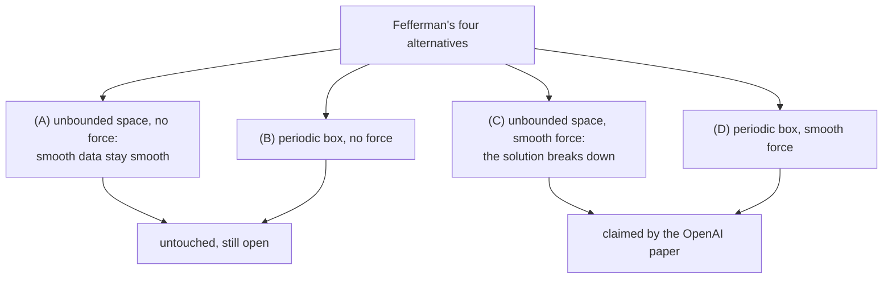
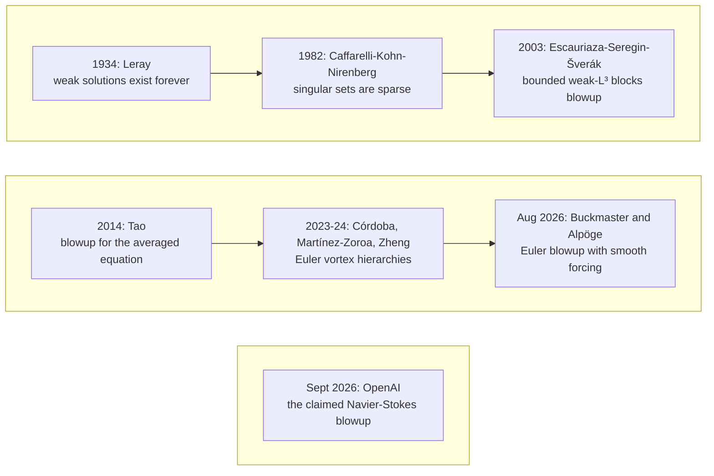
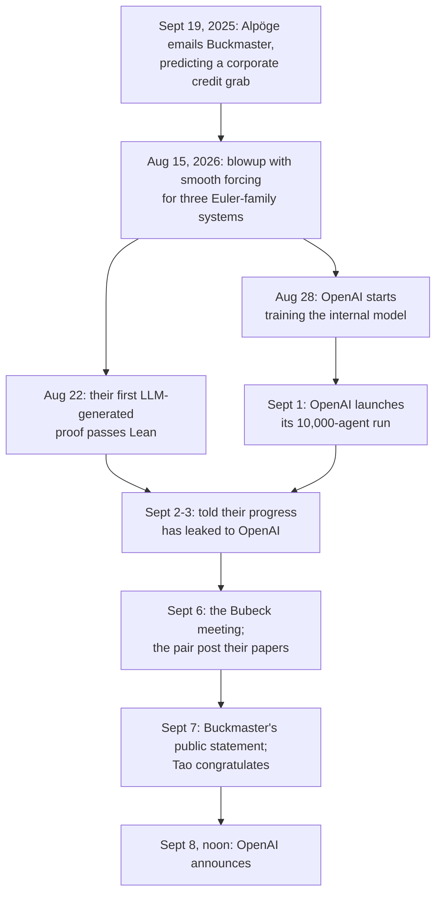

At noon on September 8, OpenAI announced that a swarm of its AI agents had resolved a Millennium Prize problem. The paper is about 165 pages, the author line reads "OpenAI," and it lives on the company's own content-delivery network; there is no arXiv version. The problem is Navier-Stokes existence and smoothness, the Clay Mathematics Institute's million-dollar question about how fluids move, and the announcement landed two days behind the pair of mathematicians who had spent the previous year expecting exactly this to happen, having already posted blowup proofs of their own for the Euler equations, the same problem's viscosity-zero cousin.

**The claim is the blowup half.** The paper, "Finite Time Blowup for Navier-Stokes," constructs a solution of the 3D incompressible equations that starts from rest, develops unbounded velocity in finite time, and keeps its total kinetic energy bounded the whole way. That covers scenarios (C) and (D) of the official problem, the ones where a smooth external force helps things along. Scenarios (A) and (B), where nothing pushes and smoothness has to survive on its own, are untouched. A Lean formalization machine-checks the proof. What nobody has checked yet are the two things a proof checker cannot see: whether the formalized statement says what mathematicians intend it to say, and whose mathematics the machine walked in on.

This post walks through it in order. It starts with the equations and what Clay is actually paying a million dollars for, because the prize statement is more negotiable than it looks. Then it covers the ninety years of partial results the claim stands on, the construction itself, what a proof checker does and does not certify, the credit fight that started before the announcement did, and finally whether a singularity in the equations would mean anything about actual water, which it would not.

## 1. The equations

The Navier-Stokes equations describe how a fluid moves. Claude-Louis Navier wrote down the first version in 1822; George Stokes got to the modern form in 1845. For an incompressible fluid they read:

$$\frac{\partial u}{\partial t} + (u \cdot \nabla) u = -\nabla p + \nu \nabla^2 u + f$$

$$\nabla \cdot u = 0$$

- $u(x, t)$ is the velocity field: the speed and direction of a small parcel of fluid at each position and moment.
- $p$ is pressure per density, $\nu$ is viscosity, and $f$ is an external force, the spoon stirring the tea.
- The second line, $\nabla \cdot u = 0$, is incompressibility: push the fluid in one place and it has to come out in another; you cannot crush it into one spot.

Read the first line as a balance: change in velocity over time, against the fluid carrying itself along, plus pressure, plus viscous smoothing, plus whatever force is applied. Everything from weather to waves to astrophysics runs on it, for fluids moving well below the speed of sound and nowhere near the speed of light.

The problem lives in one fight inside that balance. The advection term $(u \cdot \nabla) u$ is quadratic in $u$, and nonlinearities can amplify themselves; this is the term that wants to blow up. The viscosity term $\nu \nabla^2 u$ smooths gradients out, and it wins at short distances. Which one dominates is scored by the Reynolds number, $Re = UL/\nu$: a characteristic velocity times a characteristic length, over viscosity. Osborne Reynolds charted the transition in pipe flow in the 1880s. At large $Re$ the nonlinear term wins, and turbulence lives there. At small $Re$ viscosity wins: slow, thick, smooth flow. Honey.

The blowup question is whether the fight can produce a singular solution from clean inputs: start with perfectly smooth initial data, apply only smooth forces, and ask whether the velocity can still run off to infinity in finite time or whether the solution stays smooth forever. Tony Padilla, the physicist walking through the claim on [Numberphile](https://www.youtube.com/watch?v=3geDF-DAwpg), offers an analogy for a nonlinearity manufacturing a singularity out of smooth starts: a star collapsing to a black hole. General relativity is also nonlinear, and the Hawking-Penrose theorems prove its singularities form. So the idea is not crazy. The question is whether it happens here.

## 2. What Clay is paying for

The Millennium Prize Problems are seven problems the Clay Mathematics Institute announced in Paris on May 24, 2000, with \$1 million attached to each. Poincaré is the only one ever awarded: Grigori Perelman posted his proof to arXiv in 2002-03, the verification wrapped in 2006, Clay made the award in March 2010, and Perelman declined the prize in 2010, as he had declined the Fields Medal in 2006.

For Navier-Stokes, [Charles Fefferman's official problem statement](https://www.claymath.org/wp-content/uploads/2022/06/navierstokes.pdf) asks for a proof of any one of four alternatives:

- (A) In unbounded space with no force, smooth initial data stay smooth forever.
- (B) The same, in a periodic box.
- (C) In unbounded space, exhibit smooth initial data and a smooth force under which the solution breaks down.
- (D) The same, in a periodic box.

The list is worth reading twice, because it is stranger than it looks: the alternatives are not negations of each other, and all four could hold. A proof of (C) or (D) would sit comfortably beside a proof of (A). The prize goes to whoever resolves any one of the four.

The rules matter this month. A claimed solution has to appear in a refereed "qualifying outlet" and then wait at least two years for community acceptance before Clay will consider it, and Clay [does not accept submissions](https://www.claymath.org/millennium-problems/rules/); it reads the literature. That machinery, not any judgment about the mathematics, is why a paper posted to a lab's own website carries no prize, whatever it turns out to contain.

<figure className="my-4">

<figcaption>Fefferman's four alternatives: the claim covers (C) and (D), the blowup half; (A) and (B) stay open.</figcaption>
</figure>

## 3. What was already known

Ninety years of partial results stand between Leray and the announcement, and every one of them moved the same two dials: what counts as a solution, and how much help the force is allowed to provide.

In 1934, Jean Leray proved that weak solutions, his word was "turbulent solutions," exist forever in 3D. He got there by multiplying the equation by smooth test functions and averaging, which moves derivatives off the possibly-wild velocity; the price is that he was no longer solving the full system, only its shadow. Every result since lives in the gap between what Leray could prove and what the equations actually ask.

In 1982, Caffarelli-Kohn-Nirenberg showed that if blowups exist, they are sparse: the singular set of a suitable weak solution has parabolic 1D measure zero. In 2003, Escauriaza-Seregin-Šverák showed that a solution whose velocity stays uniformly bounded in weak-$L^3$ cannot blow up. Both fence the problem in without closing it.

In 2014, Terence Tao proved [finite-time blowup for an averaged version of the equation](https://arxiv.org/abs/1402.0290) (arXiv:1402.0290), the nonlinear term replaced by a smoothed stand-in he could control. The result sounds like a near miss and functions as a wall: any proof that true Navier-Stokes solutions stay smooth has to use fine structure of the exact nonlinearity, not just good estimates, because the good estimates all survive averaging.

Meanwhile, the viscosity-zero case. Euler's equations, from the 1750s, are Navier-Stokes with $\nu = 0$: no smoothing term, so singularities should come easier. Euler is not a prize problem, but Fefferman's statement notes that the same questions are open there and matter. In 2023-2024, Diego Córdoba and Luis Martínez-Zoroa, with Fan Zheng on some papers, built 3D Euler blowups out of hierarchies of vortices, bigger ones amplifying smaller ones, "a clockwork of vortices" in Padilla's telling, with finite total energy; one of their results is unforced, smooth everywhere except a single point. Their forced results used forces that were highly regular but not fully smooth, one notch short of the standard the prize statement demands.

On August 15, 2026, Tristan Buckmaster of the Courant Institute and Levent Alpöge, a member of technical staff at Anthropic, closed that notch for three Euler-family systems: 3D Euler, 2D Boussinesq, and the incompressible porous medium equation, blowup under [smooth forcing](https://cims.nyu.edu/~tristanb/euler.pdf). Their first LLM-generated proof passed Lean verification about a week later, on August 22. Fefferman has called Córdoba and Martínez-Zoroa "the heroes of the story." Keep all of these names; the last section of this post is about them.

<figure className="my-4">

<figcaption>From Leray's weak solutions in 1934 to the claimed Navier-Stokes blowup in 2026.</figcaption>
</figure>

## 4. The claim

OpenAI launched its run on September 1 and the agents reached their resolution on September 5, about 88 hours later. Per Quanta, the agents produced an unforced Euler blowup first, with about 100 agents over about 50 hours, and only then moved to Navier-Stokes. The solving ran on an unnamed internal model, which OpenAI describes as more capable than GPT-6 Astra and has not released; GPT-6 Astra then spent about 17 more hours formalizing the proof in Lean; and Codex passed findings between agent groups. The totals for the Navier-Stokes effort alone come to roughly 10,000 concurrent agents, 2.7 million messages, and 130 billion output tokens; counting every problem the run attempted, 4.9 million messages and 300 billion tokens. Sébastien Bubeck put the cost at "several million dollars." Outside estimates run from about \$6.5 million (token-price arithmetic, per Business Insider) through \$10 million (BBC) to \$15 million (Simon Willison's figure, which matches the price OpenAI quoted at its own press conference for a rerun). Some estimates go higher.

The paper appeared on September 8, 2026: "Finite Time Blowup for Navier-Stokes," about 165 pages, author listed as OpenAI, [announced here](https://openai.com/index/navier-stokes-solution/) with the [PDF on the company's CDN](https://cdn.openai.com/pdf/32d9f210-8b73-45e0-91bc-82a30aef8a9a/navier-stokes.pdf) and no arXiv version. It claims a solution of the 3D incompressible equations that starts from rest, develops unbounded velocity in finite time, and keeps total kinetic energy bounded the whole way. Starts from rest is worth a pause: no clever initial condition does the work here, the fluid organizes its own catastrophe out of smooth data plus a smooth force.

The construction, as Padilla walks through it, has a "wild core" at its center: fluid that spirals radially inward toward an axis and, because it cannot pile up there, shoots axially up and down. Write $\tau$ for the time left before blowup. The radial length scale shrinks like $\tau^{1/2}$ and the axial scale like $\tau^{1/2-h}$ with $0 \lt h \lt 0.01$, so the core becomes a slender column. Swirl and axial velocities blow up like $\tau^{-1/2-h}$; the radial component only like $\tau^{-1/2}$. The Reynolds number built from the swirl therefore blows up, roughly like $(T - t)^{-h}$ as blowup time $T$ approaches, while the radial one stays bounded: nonlinearity beats viscosity only around the swirl, and that is what drives the singularity. One detail from the paper sounds backwards: the core's kinetic energy drops to zero even as its velocity blows up.

The hard part is the seam. A wild core on its own is not a solution of the whole problem; it has to be joined to a boring exterior far away without applying infinite or sharp forces, which the rules forbid. The trick is to hit the annular region between with tiny wave-like pulses whose average is zero, so they inject no net force, but whose square does not average to zero. The quadratic nonlinearity converts that mean square into the large effective force the transition needs. The pulses are seeded by exponentially small forces and grown by the background shear, and the paper needs two pulse families to pull it off.

That covers scenarios (C) and (D): smooth data, smooth force, breakdown in finite time. Scenarios (A) and (B), where nothing pushes, are untouched, which is why "solved," the word Quanta's headline reaches for, should be read as "the blowup half."

## 5. What checked means

The machine-checked part of the proof is the least controversial part. Lean is a proof assistant: it accepts a derivation only when every step follows from earlier ones under fixed rules, so a Lean-verified proof has no gaps of the kind peer review usually hunts for. What it cannot check is the seam between the formal statement and the mathematics. Per Quanta's Konstantin Kakaes, the human work still open is confirming that the formalized statement says what mathematicians intend it to say. A formalization is faithful or it is not, and no proof checker notices the difference.

Nothing has been refereed or journal-published. The paper exists as a PDF on a lab's content-delivery network. Clay's rules, again, want a qualifying outlet and two years, and Clay does not accept submissions. Martin Bridson, the institute's president, has described the evaluation as "deliberately unhurried," the institute still lists the problem as active, and OpenAI says it does not intend to claim the \$1 million.

The main public walkthrough also needs its own corrections, which are worth logging because they show how a story like this degrades in transmission. The [Numberphile video](https://www.youtube.com/watch?v=3geDF-DAwpg) puts the problem's age at "the best part of 100 years"; OpenAI's own count is about 90, from Leray's 1934 work, and the equations themselves go back to 1822. It says Poincaré "was solved in the mid-2010s"; the proof went up in 2002-03 and Perelman declined the prize in 2010. Its transcript renders Alpöge as "Alparslan." And it puts the $1/2-h$ exponent on an "angular" scale; the paper puts it on the axial scale. None of this touches the mathematics, and all of it touches how the mathematics reached you.

## 6. The priority fight

Two days before OpenAI's announcement, Buckmaster and Alpöge posted the three smooth-forcing Euler proofs from Section 3. Both efforts worked the same research program, the one Córdoba and Martínez-Zoroa started. The overlap was not a coincidence of timing; it was a collision the mathematicians saw coming. On September 19, 2025, Alpöge emailed Buckmaster predicting that Navier-Stokes would be the next Millennium problem solved and worrying that corporations would claim the credit. They began a private collaboration, strictly personal; both later stressed it was not an Anthropic project.

<figure className="my-4">

<figcaption>Two programs on the same road, and the meeting where they collided.</figcaption>
</figure>

OpenAI started training the internal model on August 28 and launched the run on September 1, reportedly after rumors that Anthropic was about to solve Millennium problems of its own; Alpöge's August 31 tweet reading "Augustus Mirabilis" is later cited as fuel. On September 2 and 3, told their progress had leaked to OpenAI, Alpöge contacted the company and Buckmaster emailed a prominent OpenAI mathematician. On September 6, Bubeck told Alpöge the problem was solved and asked Buckmaster to meet. OpenAI denies direct file access but says de-identified training data derived from the pair's sessions was used; Buckmaster says he asked twice whether the model had trained on their Codex sessions, where their drafts lived, and that the question went unanswered. The pair posted their three papers that day. Buckmaster's [public statement](https://cims.nyu.edu/~tristanb/statement.pdf) went up on September 7, and Terence Tao congratulated them. OpenAI announced at noon on September 8.

Per that statement, OpenAI offered two deals at the meeting: simultaneous announcements, or Buckmaster writing the Navier-Stokes paper alone with credit to an internal OpenAI model. He says Bubeck twice pressed to leave Alpöge off the paper, because Alpöge works at Anthropic, and that when Buckmaster refused and said he would go public, the replies included "Why would you ruin your career?" and "If you don't want me to be nice, then I don't have to be nice." He took that as a threat. Bubeck disputes the account: he says he offered lead rather than sole authorship, and he apologized for the wording.

The statement is careful where it counts. Buckmaster had not seen OpenAI's proof, does not know whether his data was used, and is "not accusing anyone of anything." He called his own Euler writeup "AI slop. I am sorry for this," and the situation a Deep Blue-Kasparov moment. To The Verge (Robert Hart, September 12) he put it another way: all he had to do was "throw Levent under the bus."

OpenAI's own account moved four times in six days. On September 8: "no specific user data was accessed," but OpenAI "cannot rule out that de-identified data derived from their usage" helped improve its models. On September 9: influence through Buckmaster's Codex prompts is "categorically impossible." On September 10: an internal investigation finds the prompts "could not have influenced the system in any way, including through training." On September 13: "no user inputs past July 3rd could have influenced this system in any way."

The rest of the field picked sides in public. Córdoba's verdict: "if [our] work had not existed, AI would not have solved the problem," and Scientific American reported that OpenAI's proof follows a method similar to the pair's. On September 11, 25 Fields Medalists published [a letter](https://mathandai.org/) titled "A Severe Misalignment of AI in Mathematics," stating that "the goals of the AI companies and the goals of the mathematical community are severely misaligned"; it names no company. On September 16, 42 Royal Society Fellows wrote to Sir Paul Nurse about the pace of AI development, with roughly 127 more mathematicians signing later. On September 17, Timothy Gowers explained why he had not signed the Fields letter, calling the proof legitimate and the bargain "pretty good." Tao said he was not eligible to sign the Royal Society letter because he works in various collaborations with the AI industry; his [blog](https://terrytao.wordpress.com/) carried the letters, the dissent, and the follow-on essays that gathered there.

As of this writing the fight is unresolved. Clay has endorsed nobody and still lists Navier-Stokes as active. The dispute has [its own Wikipedia article](https://en.wikipedia.org/wiki/Navier%E2%80%93Stokes_priority_controversy), which is either progress or a diagnosis.

## 7. Does the blowup matter physically?

No. The equations are an effective description: they break down below the molecular scale and at near-light speeds, the way general relativity gives out near a black hole singularity. A blowup would mark where the equations stop holding, not an infinite velocity anywhere in nature, and nobody should expect the tea to notice. That is Padilla's verdict in the video, and the standard one in physics. The black-hole analogy from Section 1 survives in exactly that form. In general relativity, the singularity is where the theory meets its edge; a Navier-Stokes blowup would be the same thing, a fence post in the mathematics rather than a fact about water.

## The precedent

Whatever refereeing eventually decides about the proof, the run itself already answers a question people were asking before it happened: whether AI can produce new mathematics at the research frontier or only check human work. A Lean-checked 165-page construction, assembled in 88 hours and formalized in 17 more, is evidence on the producing side. It also answers a different question on its own. OpenAI started the project after rumors, reported but never confirmed, that Anthropic was about to solve Millennium problems of its own, and ran it on a model it has not released, so the first claimed Millennium resolution by a machine rather than a person did not happen despite the race between the labs. It happened because of it.

Three gaps stay open, and none of them is about the equations. Between the formalized statement and what mathematicians intend: Lean cannot see that seam. Between a PDF on a lab's CDN and a refereed outlet: Clay's machinery, and two years, at minimum. Between the lab's account of where its model learned the method and the mathematicians' account of where the method came from: de-identified training data, four statements in six days, and a threat allegation nobody outside the room can arbitrate.

Clay posted four alternatives in 2000 and pays the same million dollars for any one of them. The record this month: (C) and (D) claimed, by a machine-checked proof no journal has touched; (A) and (B) open; the prize unclaimed, and by OpenAI's own statement it will not be claimed; the method's provenance disputed in four statements over six days; and, underneath all of it, ninety years of human work, from Leray's test functions to a clockwork of vortices. The equations have been asking the same question since 1822, and the tea was never in danger. The credit was.
