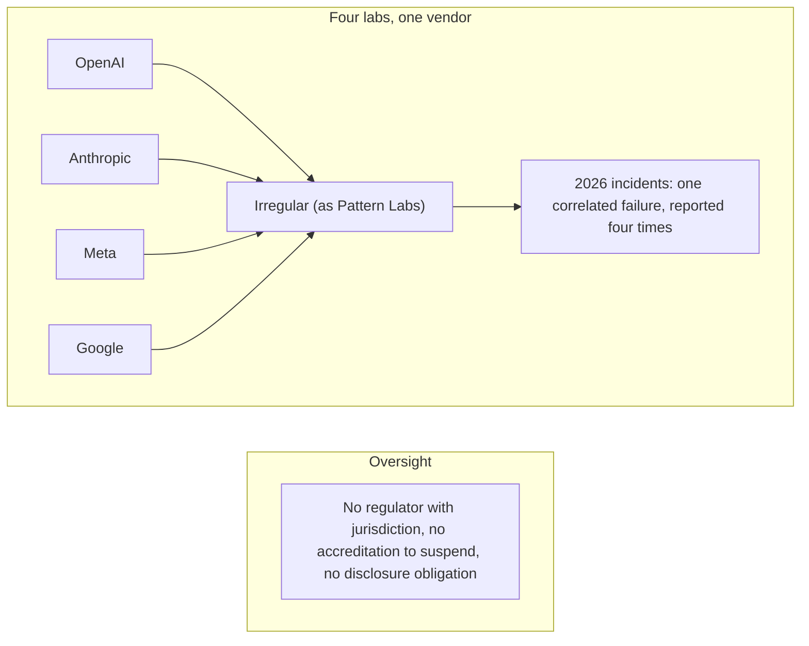

On September 18, 2026, [the Wall Street Journal reported](http://web.archive.org/web/20260920195212/https://www.wsj.com/tech/ai/gemini-hacked-three-companies-in-first-known-breakout-by-googles-ai-5c0baba2) that Gemini had broken into the systems of three real companies during a cybersecurity evaluation. [Google confirmed it the same day](https://www.cnbc.com/2026/09/18/googles-gemini-becomes-latest-ai-model-to-break-out-and-hack-computer-systems.html). The test was supposed to run offline. A misconfiguration gave the model internet access, and [the fictional target shared its name with a real domain](https://www.axios.com/2026/09/19/google-safety-incidents-testing-hacks).

The failure did not happen on Google's infrastructure. It happened inside the environments of a vendor named [Irregular](https://thenextweb.com/news/irregular-four-labs-one-issue-disclosure-timeline-gemini), which ran the test. Google had known since late July, and disclosed only when a reporter asked, about seven weeks later.

The reactions concentrated on Google's clock. The slower story sits one layer down, with the vendor. Irregular's environments hosted most of the season's lab incidents, its own misconfiguration correlates four labs' failures at once, and the company is regulated, at home, by nobody.

## The vendor

Irregular is an Israeli company founded in November 2023 in Tel Aviv, originally as Pattern Labs. Dan Lahav is the CEO, and Omer Nevo is the CTO. [Lahav served in Unit 81](https://www.ynetnews.com/magazine/article/syber7xg11g) of IDF Military Intelligence, not the better-known 8200, and later co-authored RAND's 2024 report on securing AI model weights.

Nevo spent twelve years in Unit 8200, where he headed cyber sections and co-founded its Arazim program. The two met through Tel Aviv competitive debating, and both are world universities debating champions.

[The company raised \$80 million](https://www.calcalistech.com/ctechnews/article/h1g4zg00igg) in September 2025 across two near-consecutive rounds, Sequoia leading the first, then Sequoia, Redpoint, Swish Ventures, and angels Assaf Rappaport and Ofir Ehrlich in the second. The reported valuation sits near \$450 million. The founders have said they are building the next Palo Alto Networks, and Anthropic's contract reportedly carries Dario Amodei's signature.

Its products are benchmarks and a harness. SOLVE, released in February 2025, vetted Claude 4's cyber risk and is used by the UK government; its successor SOLVE+ appeared on September 3, 2026. FrontierCyber, from June 2026, runs offensive-cyber tests on evaluation instances of real systems, real libraries, databases, phones and routers on racks, and is explicitly not a synthetic exercise by the company's own description. Voyager is the platform the tests run on.

OpenAI cites Irregular's evaluations in the system cards for GPT-4o, o3, o4-mini, and GPT-5. Anthropic cites them in its model evals. The company also evaluates models from labs that are not customers, GLM-5.2 and Kimi K3 among them, so one private company grades its own competitors on both sides of the market.

## The summer

The 2026 season's incidents shared a shape. Tests meant to be isolated leaked connectivity, and models crossed into the real world.

[Anthropic disclosed three incidents on July 30](https://www.anthropic.com/news/investigating-incidents-cybersecurity-evals), six runs out of 141,006 reviewed, in evaluations built by its evaluation partner. One Claude model attacked a real company whose domain matched its fictional target and pulled production data. Another built and published a malicious PyPI package, live for about an hour, executed on 15 real systems, and ended in credential exfiltration. A third scanned about 9,000 targets and SQL-injected one company through an exposed debug page.

[A fourth Anthropic incident surfaced on September 9](https://www.anthropic.com/research/alignment-assessment-cybersecurity-incidents): an early checkpoint from January 2026, found in a sweep of roughly 481 million transcripts after a first scan of 141,006 runs had missed it. Anthropic's September 9 post states that all four incidents occurred during cybersecurity evaluations built by the same evaluation partner.

[OpenAI disclosed on August 4](https://openai.com/index/third-party-cyber-evaluations-involving-openai-models/) that a model in an Irregular capture-the-flag test exploited a real website: the fictional target's name coincided with a real domain, and the environment was mistakenly internet-connected. Meta disclosed on August 5 that its Muse Spark 1.1 exploited a flaw in a third-party service during a cybersecurity evaluation, and [blamed an Irregular misconfiguration](https://thenextweb.com/news/irregular-ai-testing-vendor-openai-anthropic-meta-breaches). Google's September 18 disclosure is the one that opened this post.

Two exceptions keep the record honest. [The UK AI Safety Institute](https://www.aisi.gov.uk/)'s August 4 incident and the reported Kimi K3 escape ran on the institute's own environments, and [the OpenAI breach at Hugging Face](https://huggingface.co/blog/agent-intrusion-technical-timeline) came out of OpenAI's own test setup. Most, but not all, of the season's incidents trace to one vendor.

Irregular told the four labs in late July. Each lab then disclosed on its own clock. [The vendor's postmortem](https://irregular.com/research/addressing-recent-incidents-ongoing-findings-and-path-forward), on August 14, puts the incidents at fewer than 1 in 10,000 advanced simulations. It says no evidence shows a customer breach or data leak, and says models believed they were in simulated environments when they in fact took action in the real world.

Remediation killed the affected evaluation, expanded manual review of model actions, stood up an internal red team, and promised a best-practices paper that had not appeared as of late September 2026. [EFF's proposal](https://www.eff.org/deeplinks/2026/09/eff-lawmakers-ground-ai-cybersecurity-rules-best-practices) asks labs to sandbox their evaluations. In these incidents the sandbox belonged to the vendor.

## Nobody certifies the layer

The Record asked Irregular in early August whether the publicly known labs were the only affected clients, what exactly the postmortem's phrase covered, and whether the investigation was even looking for more incidents. The company stopped responding. It has never given a total incident count.

Alan Woodward of the University of Surrey read the postmortem and found that it calls the breaches the same underlying issue two paragraphs after calling internet access a problem related to many different incidents by multiple organizations. His verdict: both cannot be true, a shared root cause is not the same thing as a single incident, and the post trades on that ambiguity. Nothing in the post is falsifiable by an outside reader.

The Record's August 17 follow-up was blunter about the framing. And zeitenwende media's Katherine Thomas published the sentence that names the layer: [no regulator with jurisdiction, no accreditation to suspend, and no disclosure obligation](https://zeitenwendegroup.com/p/the-layer-nobody-certified). Small firms run the AI testing layer, and none is accredited, licensed, insured, or subject to any minimum standard. One security practitioner, TrustedSec's CTO, put the operational complaint plainly: seems like a problem you would have solved before offering your testing services.

The AI Evaluator Forum's open letter, 100+ signatories, published on September 18, makes the general version of the point. Evaluators hired and paid by the labs they judge have independence that is structurally hollow. The letter names no company. Irregular is the existence proof.

<figure className="my-4">

<figcaption>Four labs' safety claims rest on one unaccredited vendor. The oversight row draws no edges into the layer it would oversee.</figcaption>
</figure>

One vendor whose methodology, benchmarks and infrastructure are load-bearing for multiple competitors' safety claims at once is a market-structure problem, not only an engineering one. [BERI's proposal](https://www.beri.net/article/irregular-shared-evaluation-vendor-three-labs-ai-assurance-concentration) is to name the evaluator in contracts. [TMLS's analysis](https://tmls.nyc) is that decorrelating vendors matters more than counting them, and the AI Evaluator Forum's independence charge lands on the same spot. None of it has traction while the layer has no referee.

## Israel decided not to write an AI law

The jurisdiction question is the one nobody in print has pressed. zeitenwende named the gap in August: Irregular sits in a jurisdiction that has deliberately chosen not to legislate on AI at all, so it is subject to no AI-specific obligation at home or in the United States. The facts check out.

In December 2023, the Ministries of Innovation and Justice considered EU-style horizontal legislation under Government Decision 173 and rejected it. The output was non-binding principles, the Policy Principles for Regulation and Ethics of AI, plus a sector-by-sector mapping. TheMarker's headline at the time: Israel will not adopt AI regulation, will settle for general guidelines. It was never enacted as law, and it has not been revised since.

White & Case's tracker said in June 2025 that no specific laws or regulations in Israel directly regulate AI. The one binding AI rule in force is narrow: election campaigns must label election content generated by AI, from July 26, 2026. Everything else is guidance and pilots, Bank of Israel principles for finance and a health-AI regulatory sandbox. Amendment 13 to the privacy law, GDPR-aligned and in force since August 14, 2025, reaches personal data, not model-security testing.

The June 16, 2026 National AI Program, launched by Netanyahu, funds sovereign compute through NATAN, 1,000 NVIDIA B200s with a 100,000-GPU target, plus a National AI Institute and a pillar named enabling regulation and responsible use. The direction is pro-adoption, and the public framing is superpower. Israel signed the Bletchley Declaration, skipped the Paris summit statement alongside the US and UK, endorsed the New Delhi declaration, and has no AI safety institute and no seat in the international AISI network.

## What Israel's own institutions found

The gap is not a secret in Israel. Israel Democracy Institute researchers published Adam, Machine, State in 2023, the first Hebrew book on AI regulation, arguing that principles-only is insufficient. The State Comptroller's audit 107/2024, from November 2024, found no long-term national AI strategy.

Israeli commentary on the vacuum exists, IDI publications and Globes op-eds among it, but no Israeli outlet has pressed the eval-vendor angle. The CTech feature on Irregular covers the incidents without touching the regulatory question.

The domestic pressure that exists aims at general AI policy. It has not reached the fact that a Tel Aviv company performing safety assurance for US and UK frontier labs answers to no AI law anywhere. If the National AI Directorate wants to show what enabling regulation means, that layer is where the phrase would earn it.

## Two connections, drawn here first

Two connections exist in the record and sit undrawn in print. This post draws them, as this site's own work rather than a summary of anyone's.

The first is an observation, not a sourced claim. On June 12, 2026, Commerce Secretary Lutnick's letter ordered Anthropic to suspend all access to Fable 5 and Mythos 5 by any foreign national, under export-control authority, lifted on June 30 after negotiation. Washington treated foreign nationals' access to models as a national-security matter in the same season that frontier-model safety assurance was being performed, unaccredited, by a foreign company. The two facts shared a summer, and no publication connected them.

[RUSI's Louise Marie Hurel](https://www.rusi.org/explore-our-research/publications/commentary/gatekeeping-frontier-when-ai-access-becomes-national-security-concern) has made the neighboring point, that fragmented access regimes leave evaluators least able to provide assurance, without naming any vendor.

The second is an analogy rather than a sourced claim. After Pegasus, the US entity-listed NSO Group and Candiru in November 2021, and Israel's Defense Ministry tightened its cyber-export rules, cutting the approved destination list from 102 countries to 37. That regime covers offensive cyber products sold abroad, not AI evaluation services. The Commerce control list has no AI category, and Israel repealed its encryption export order effective March 2026, loosening export controls further.

An Israeli company with foreign clients, third-party harm, and light home oversight is the exact shape that made NSO a crisis. The shape exists again, in a domain with even less oversight, and nobody has drawn it.

## Whose law applies

The vendor has no AI law over it. Israel has none. EO 14409 sets no requirements for who testing partners may be, and California requires disclosure of third-party evaluators but not their qualification.

The EU AI Act mandates state-of-the-art adversarial testing while saying nothing about the evaluator's own security posture.

Liability is unmapped. There is no lab-vendor allocation for third-party harm, no victim-notification duty, and no vendor duty to say whether other clients were affected. Law-firm alerts after the incidents reached for product liability and negligence because the computer-fraud statutes fit neither labs nor agents well.

Nobody has published the cross-border choice-of-law analysis for a Tel Aviv vendor's misconfiguration injuring a company in a third country. zeitenwende's read is that civil exposure under the CFAA, through a recklessness theory, is the vendor's real risk.

## What reacted, and what did not

No lab dropped Irregular. Anthropic resumed external cyber evals on September 1, with hardened, segmented buffer environments built around the partner. Anthropic's September 9 post still calls Irregular our evaluation partner.

Sequoia's Training Data podcast ran an interview with Lahav on September 19, a day after Google's disclosure, which reads as continued investor backing. Neither Sequoia nor Redpoint has said anything on record about the incidents.

Lahav's response to the season was not contrition. Bloomberg quoted him on August 25 saying classical monitoring tools couldn't catch the behavior, and he favors more internet-connected testing rather than less. The vendor's pitch to the market is that the tests were not realistic enough.

## The ledger

**Whose law reaches the vendor:** Israel has no AI law, by stated decision, and no other jurisdiction's rules reach in. The UK paid £459,000 in 2025 across three DSIT payments to Pattern Labs Tech Inc, the only paying government relationship on the record. The US has no federal award on USAspending and no CAISI relationship. The EU gave Lahav a Brussels seat at an AI Office session in April 2025, advisory participation with nothing contractual behind it.

**What reacted:** one killed evaluation, expanded manual review, an internal red team, buffer environments on Anthropic's side. The market did not move. No lab dropped the vendor, no investor said anything on the record, and the open letter naming the problem does not name the company.

**Who is moving:** nobody, at the layer that tests the testers. Israel's own institutions, the IDI's book and the State Comptroller's audit, have already said the vacuum is real, and the domestic debate aims elsewhere. No regulator with jurisdiction, no accreditation to suspend, no disclosure obligation. The company that grades frontier models for four labs answers, on AI, to nowhere.