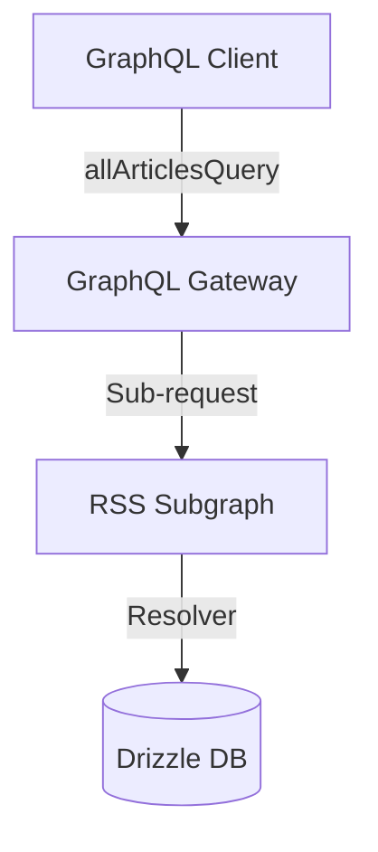

# Software Detailed Design: allArticles Resolver and Schema Update

## Component Design

- **GraphQL schema**: `allArticles(first: Int, after: String, isRead: Boolean): ArticleConnection!` is added to `Query`.
- **Resolver**: `allArticlesQuery(database: Database)` in `all-articles.ts` implements the resolver function.
- **Routing**: Registered in `resolvers.ts`.

## Data Flow Diagram

