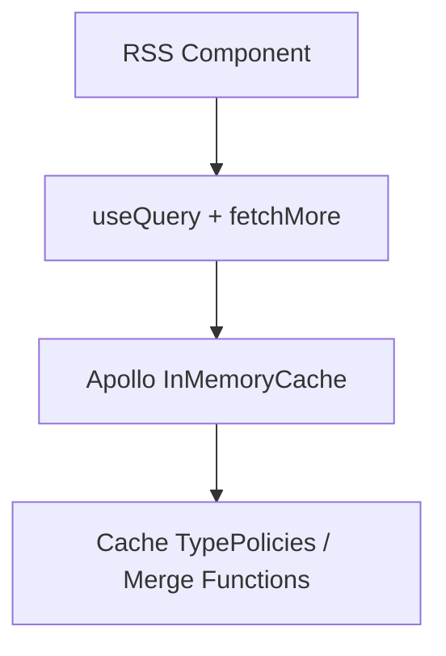
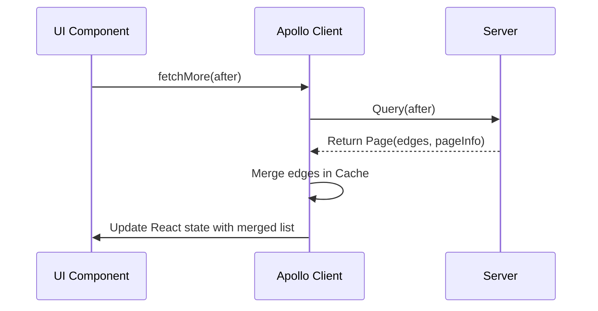

# Architecture: Apollo Cache Merge Policies and fetchMore Integration

## Technical Strategy

The frontend will use Apollo Client's `useQuery` hook. When the user triggers "Load More", `fetchMore` will be called with the `after` cursor retrieved from `pageInfo.endCursor`. To ensure the incoming items are appended to the existing list instead of replacing them, Apollo Client's cache type policies will define merge functions for `subscriptions` and `feedArticles`.

## Static View (Structure)

## Dynamic View (Behavior)

