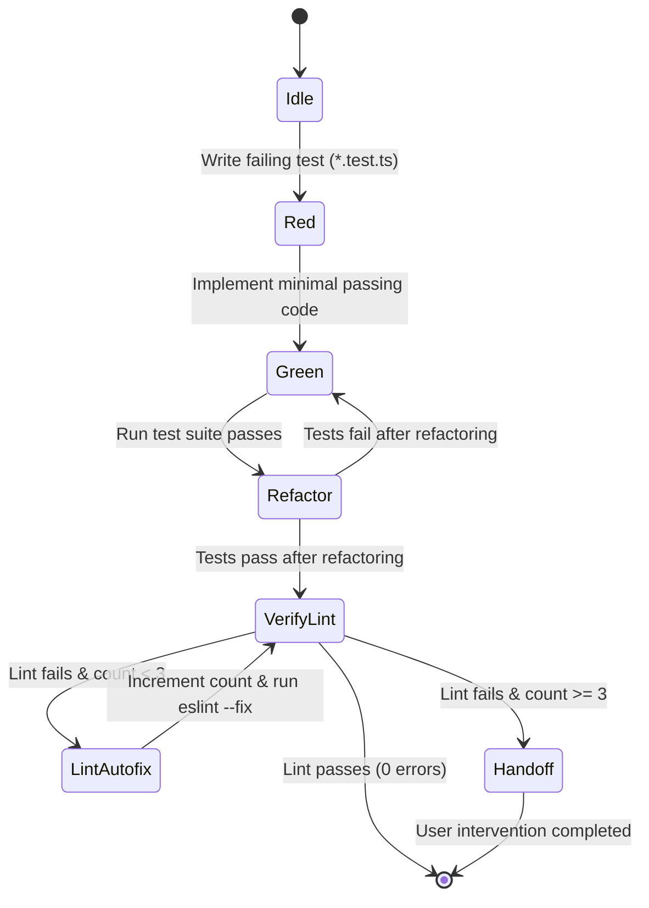
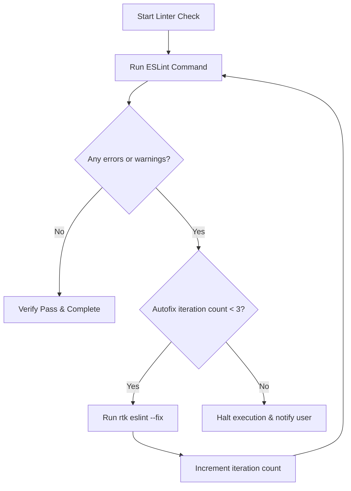

# SWDD-301: Phase 3 Guided Implementation Detailed Design

## 1. TDD Loop State Machine (SWREQ-302)

The implementation flow follows a formal finite state machine (FSM) to ensure no production code changes are made without a validated test suite baseline.

### 1.1 FSM Transitions & Verification Commands
1. **Idle to Red**:
   - Action: Add a unit test verifying the new feature requirements or reproducing a bug in the same directory as the target source file (e.g. `src/utils.test.ts`).
   - Verification: Run the test command `rtk pnpm --filter <package> test` and ensure the test fails.
2. **Red to Green**:
   - Action: Write the minimal code in the target source file to resolve the test failure.
   - Verification: Run the test command and ensure the test runs and passes.
3. **Green to Refactor**:
   - Action: Polish the code, resolve duplication, and simplify complex structures.
   - Verification: Continuously run the test suite to ensure the behavior is unchanged.

## 2. ESLint Loop Guard Flow (SWREQ-304)

To protect the context window and prevent infinite autofix cycles, the linter loop must adhere to a strict guard condition.

## 3. Coding Standards Enforcement (SWREQ-303)

Any code modified or created during Phase 3 must strictly comply with the following coding rules:

### 3.1 Syntax Guidelines
- **Arrow Functions**: Use arrow functions for all function declarations.
  - *Compliant*: `const fn = () => {};`
  - *Non-Compliant*: `function fn() {}`
- **Accessibility Modifiers**: Explicitly specify accessibility modifiers (`public`/`private`/`protected`) for all class properties and methods (including constructor parameters and class properties).
- **Index Signature Access**: Use bracket notation `obj["prop"]` instead of dot notation `obj.prop` for objects defined as index-signature types (like `Record<string, any>` or `any`) when `noPropertyAccessFromIndexSignature` is enabled.
- **Yoda Comparison Formatting**: Format comparison statements with the constant on the left.
  - *Compliant*: `undefined === value` or `null !== response` or `"env:" === trimmed`
  - *Non-Compliant*: `value === undefined` or `response !== null`
- **Luxon Date Banning**: Banned native `Date` constructor and methods. Use Luxon (`DateTime`) for date parsing, validation, and manipulation.
- **TypeScript Type Inference**: Avoid specifying explicit return types in TypeScript functions unless strictly necessary. Rely on TypeScript's type inference.
