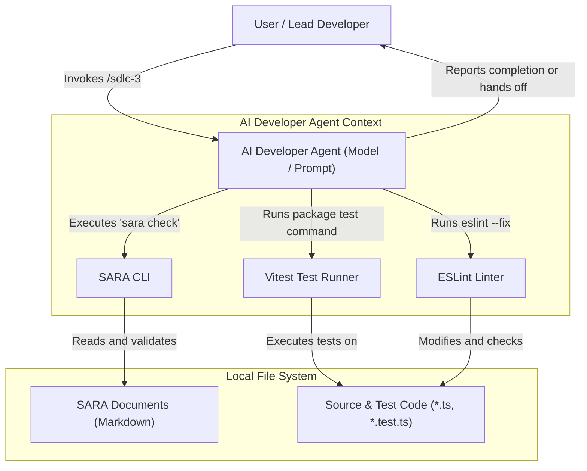

# SYSARCH-301: Phase 3 Guided Implementation Architecture

## 1. System C4 Component Diagram

## 2. Bounded Contexts and Domain-Driven Design (DDD)

### 2.1 Bounded Contexts
- **Local Workspace Context**: Encompasses the user's workspace, code repository, configurations, and documentation files.
- **SARA Graph Context**: The validated domain representing solution architectures, requirements, use cases, scenarios, and designs as an interconnected acyclic graph.
- **Agent Lifecycle Context**: The execution state of the agent as it transitions through TDD (Red, Green, Refactor) and quality verification phases.

### 2.2 CQRS Separation
- **Queries (Read-Only Operations)**:
  - Validating the SARA Graph (`sara check`).
  - Reading feature requirements, use cases, and design specifications.
  - Analyzing linter results and test runner output.
- **Mutations (State-Changing Operations)**:
  - Creating/editing `*.test.ts` files.
  - Implementing production code.
  - Running automated linter refactor loops (`eslint --fix`).

### 2.3 Domain Events
- `RequirementsValidated`: Fired after a successful `sara check` run.
- `TddCycleStarted`: Fired when initiating the Red-Green-Refactor loop.
- `TestFailedRed`: Fired when a new unit test is verified to fail under expectation.
- `TestPassedGreen`: Fired when production code successfully passes the unit test.
- `RefactoringCompleted`: Fired after cleaning code structure while keeping tests green.
- `LinterChecksStarted`: Fired when triggering ESLint checks.
- `LintErrorsResolved`: Fired when ESLint reports zero errors.
- `HandoffTriggered`: Fired if ESLint errors persist after 3 autofix iterations.

## 3. Storage Design
The primary storage layer is the **Local Workspace File System** (managed via standard Git-tracked NTFS/APFS/ext4 filesystems). No database is required for the `sdlc-3` skill execution itself, as it relies on:
- SARA Markdown files with YAML frontmatter for requirements/design metadata.
- TypeScript codebase for implementation files and test suites.

## 4. Architectural Tactics & Security Safeguards

### 4.1 Security & Input Sanitization
- **Path Traversal Protection**: The input parameter `<feature-name>` must be sanitized to prevent directory traversal attacks (e.g. prohibiting `../`).
- **Sandboxed Execution**: Executing test runners and linters should be confined to standard shell commands in the monorepo context without elevated permissions.

### 4.2 Scoped Performance
- **Scoped Test Execution**: The test command must be filtered by package (e.g. `rtk pnpm --filter <package> test`) or target file rather than running the global monorepo test suite, reducing execution latency.

### 4.3 Availability & Reliability (Loop Guard)
- **Iteration Capping**: To prevent infinite loops caused by fighting linters or contradictory rules, autofix runs are capped at exactly 3 attempts. Upon reaching the cap, execution halts to protect CPU/token budgets.
