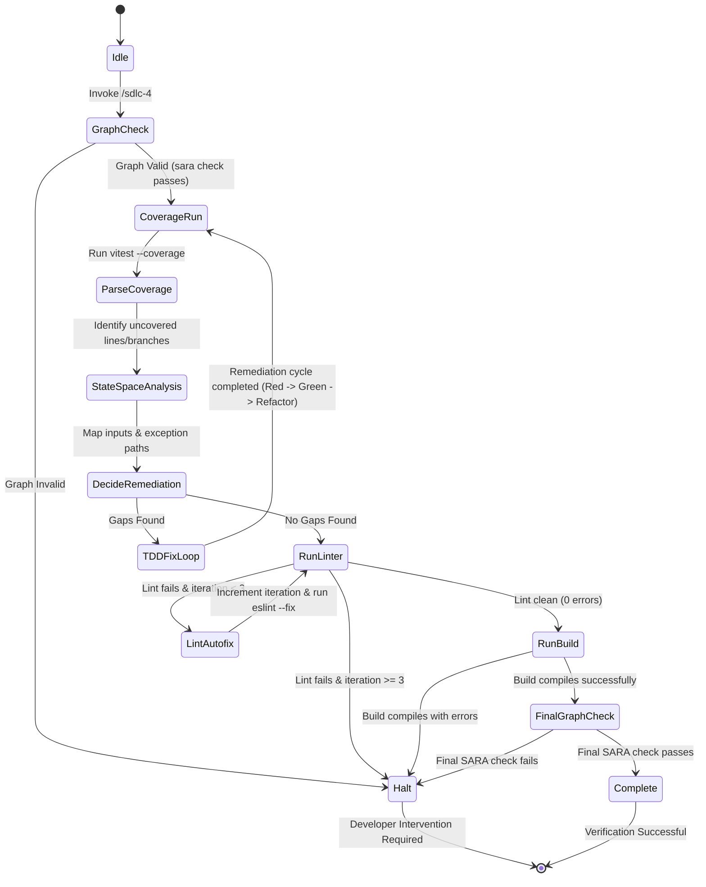

# SWDD-401: Phase 4 Verification and Testing Detailed Design

## 1. Verification and Remediation State Machine (SWREQ-401, SWREQ-402, SWREQ-403, SWREQ-404, SWREQ-405)

The `/sdlc-4` skill uses a formal finite state machine (FSM) to orchestrate package validation and automated gap remediation.



### 1.1 State Transitions and Verification Command Mapping
1. **Idle to GraphCheck**:
   - Command: `rtk sara check`
   - Verification: Checks if the SARA graph compiles without loops or missing references.
2. **GraphCheck to CoverageRun**:
   - Command: `rtk pnpm --filter <package> test --coverage`
   - Verification: Runs unit tests and outputs JSON-formatted coverage reports under the package's coverage folder.
3. **ParseCoverage to StateSpaceAnalysis**:
   - Action: Read the coverage report (`coverage/coverage-summary.json`) to find lines and functions with `< 100%` statement or branch coverage.
4. **StateSpaceAnalysis to TDDFixLoop**:
   - Action: Locate the target source file and map out the logical state space around the uncovered lines (see section 2).
   - Execution: Apply the strict Red-Green-Refactor loop.
5. **RunLinter**:
   - Command: `rtk eslint` (on modified or package files)
   - Loop Gate: If issues are found, run `rtk pnpm --filter <package> lint --fix` up to a maximum of 3 rounds.
6. **RunBuild**:
   - Command: `rtk pnpm --filter <package> build`
   - Verification: Confirms that compilation completes without errors.

---

## 2. Logical State Space Coverage Mapping (SWREQ-404)

Uncovered lines or branches in coverage reports indicate untested code paths. The agent must perform static analysis on the target file to map out the state space using the following checklist:

| Input Partition Category | Domain / Boundary Value | Expected Behavior |
| --- | --- | --- |
| **Empty/Zero State** | `""`, `0`, `[]`, `{}` | Returns default values, early-exits, or raises appropriate exceptions. |
| **Null/Missing State** | `null`, `undefined` | Sanitized safely, conforming to Yoda comparison rules. |
| **Extreme/Overflow Bounds** | `Number.MAX_SAFE_INTEGER`, very large string buffers | Handled without out-of-memory or overflow crashes. |
| **Exceptional Path** | Throwing database errors, network timeouts | Caught by try/catch blocks; logged cleanly without leaking raw traces. |
| **Asynchronous State** | Unresolved promises, slow network response | Checked for racing conditions or unhandled rejections. |

---

## 3. TDD Fix Loop & Code Standards (SWREQ-405)

When gaps are identified, the agent remediates them by writing tests and modifying code under strict TDD:

### 3.1 TDD Cycle
1. **Red Phase**: Write a unit test verifying the specific boundary or exception path in `*.test.ts`. Wrap void method calls in `expect(() => ...).not.toThrow()`. Assert correctness using bracket notation on index-signature properties (e.g. `res["isValid"]`). Verify the test fails.
2. **Green Phase**: Implement the minimal changes in the source file to make the test pass.
3. **Refactor Phase**: Clean up the code. Ensure all helper methods use arrow functions (`const fn = () => {}`) and omit explicit return types. Check that class methods use explicit accessibility modifiers.

### 3.2 Recovery & Git Hygiene
- If a remediation attempt fails, the agent must restore only the modified files using targeted restore commands:
  ```bash
  rtk git restore <path/to/modified/file>
  ```
- The agent must **never** run global resets (`git reset --hard` or `git checkout -- .`) that might discard the developer's unrelated work.
