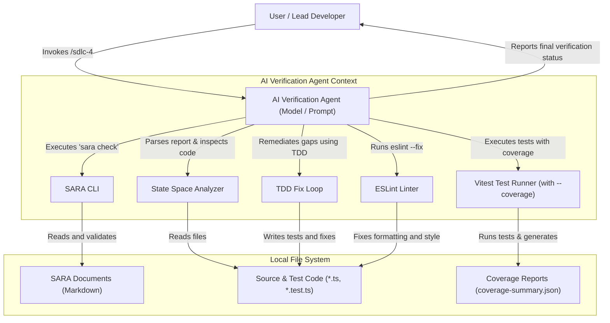

# SYSARCH-401: Phase 4 Verification and Testing Architecture

## 1. System C4 Component Diagram

## 2. Bounded Contexts and Domain-Driven Design (DDD)

### 2.1 Bounded Contexts
- **Verification Domain Context**: Encompasses the test suite metrics, code coverage files, static syntax analysis, and logical state space mapping for packages.
- **SARA Graph Context**: The validated requirements, design specs, and trace links forming the structural validation baseline.
- **Agent Execution Context**: The transient state of the agent as it executes SARA checks, gathers test coverage, analyzes code, writes tests, compiles packages, and runs autofix loops.

### 2.2 CQRS Separation
- **Queries (Read-Only Operations)**:
  - Checking requirements integrity using `rtk sara check`.
  - Reading the Vitest coverage report JSON files.
  - Analyzing source code files to build a mapping of the logical state space.
- **Mutations (State-Changing Operations)**:
  - Automatically generating missing test cases in `*.test.ts`.
  - Writing code modifications to fix failing tests.
  - Triggering linter autofix runs (`eslint --fix`).

### 2.3 Domain Events (Conceptual Milestones)
- `VerificationInitiated`: Fired upon invoking the verification process.
- `GraphValidationPassed`: Fired when `sara check` confirms a valid baseline graph.
- `CoverageRunCompleted`: Fired after Vitest finishes running tests with coverage.
- `CoverageGapsIdentified`: Fired when uncovered lines or branches are found in the coverage summary.
- `StateSpaceGapsIdentified`: Fired when boundary conditions, empty states, or exception handlers are found missing from the tests.
- `RemediationInitiated`: Fired when the agent begins writing a new test case.
- `RemediationSucceeded`: Fired when the package successfully builds and passes all tests after fixing.
- `LintAutofixesCompleted`: Fired when ESLint autofix checks finish.
- `VerificationCompleted`: Fired when the package passes build, lint, tests, and final SARA checks.

## 3. Storage Design
The `/sdlc-4` skill is **stateless** and does not require a database (like D1 or SQLite). It operates directly on the local workspace file system:
- **Input**: Source code files, existing test files, and SARA documentation.
- **Transient State**: The coverage output stored in `coverage/coverage-summary.json` or equivalent JSON formats.
- **Output**: Git-tracked modifications to source files, test suites, and SARA documentation.

## 4. Architectural Tactics & Security Safeguards

### 4.1 Safety and Integrity (No Manual Restores)
- **Targeted Code Restores**: If a remediation attempt fails or breaks existing functionality, the agent must use targeted file restores (e.g. `git restore <file>`) to revert its specific edits rather than performing destructive global resets.
- **Linter Autofix Cap**: The linter autofix loop is capped at a maximum of 3 iterations to prevent infinite loop races.

### 4.2 Security & Sandboxing
- **Path Traversal Shield**: All input parameters identifying packages or target files must be validated to prevent directory traversal (e.g. rejecting containing `..`).
- **No Elevated Privileges**: The verification loop executes command lines within the context of the user-approved terminal without administrative overrides.

### 4.3 Scoped Performance
- **Targeted Package Coverage**: Tests are executed at the package filter level (e.g. `rtk pnpm --filter <package> test --coverage`) to avoid high latency from running tests across unrelated monorepo packages.
