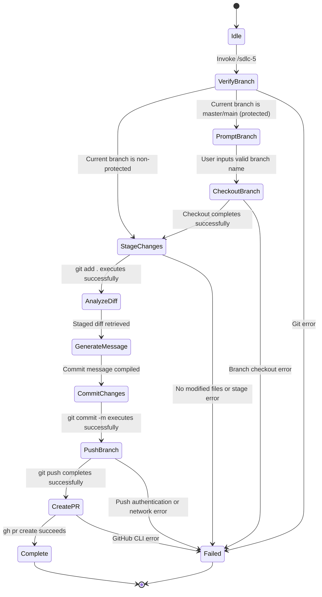

# SWDD-501: Phase 5 Release Automation Software Detailed Design

## 1. Release & PR Workflow State Machine (SWREQ-501, SWREQ-503)

The implementation flows through a finite state machine (FSM) to ensure safe, traceable, and transactional release execution.



### 1.1 FSM Transitions & Verification Commands
1. **VerifyBranch**:
   - Command: `git branch --show-current`
   - Evaluation: If output is `"main"` or `"master"`, transition to `PromptBranch`. Otherwise, transition to `StageChanges`.
2. **CheckoutBranch**:
   - Command: `git checkout -b <new-branch>`
   - Verification: Ensure exit code is 0 and branch is switched.
3. **StageChanges**:
   - Command: `git add .`
   - Verification: Ensure changes exist by running `git status --porcelain`. If output is empty, halt with error "No changes to commit".
4. **AnalyzeDiff**:
   - Command: `git diff --cached --name-only`
   - Verification: Extract list of modified file paths to determine package scopes.

## 2. Conventional Commit & Actor-Action Formatting (SWREQ-502)

To produce semantic and structured logs, the commit message generation follows a strict format constraint:

### 2.1 Commit Header Structure
The commit header follows the Conventional Commits specification:
```
<type>(<scope>): <lowercase description>
```
- **type**: Determined dynamically based on the modifications:
  - `feat`: If new packages, utilities, or main application code are added.
  - `fix`: If fixing bugs or correcting test assertions.
  - `refactor`: If refactoring existing classes without functional change.
  - `docs`: If only markdown or documentation files are modified.
- **scope**: The package name extracted dynamically from the modified files (e.g., if a file under `packages/agents-build` is modified, scope is `agents-build`). If multiple packages are modified, the scope defaults to `monorepo`.
- **description**: A short, present-tense, imperative description in lowercase (no trailing period).

### 2.2 Commit Body Structure
The commit body contains one or more atomic statements in **Actor-Action format** to specify exactly what was changed:
```
<Actor>: <Action>
```
- **Actor**: The component, module, class, or system layer responsible for the change (e.g., `compiler`, `TddFixLoop`, `authRouter`).
- **Action**: An imperative, present-tense verb phrase describing the change (e.g., `compile skills on build`, `execute tests with coverage`).

*Example Commit Message*:
```
feat(agents-build): add release automation skill

sdlc5: define Phase 5 release automation schema
compiler: compile new skill to build output
```

## 3. Remote Submission Integration (SWREQ-503)

### 3.1 Push Operation
- Command: `git push -u origin <branch>`
- Purpose: Establishes upstream tracking for the new branch.

### 3.2 PR Creation
- Command: `gh pr create --title "<commit-header>" --body "<commit-body>"`
- Purpose: Registers the pull request using the conventional header as the title and the actor-action body as the PR description.
