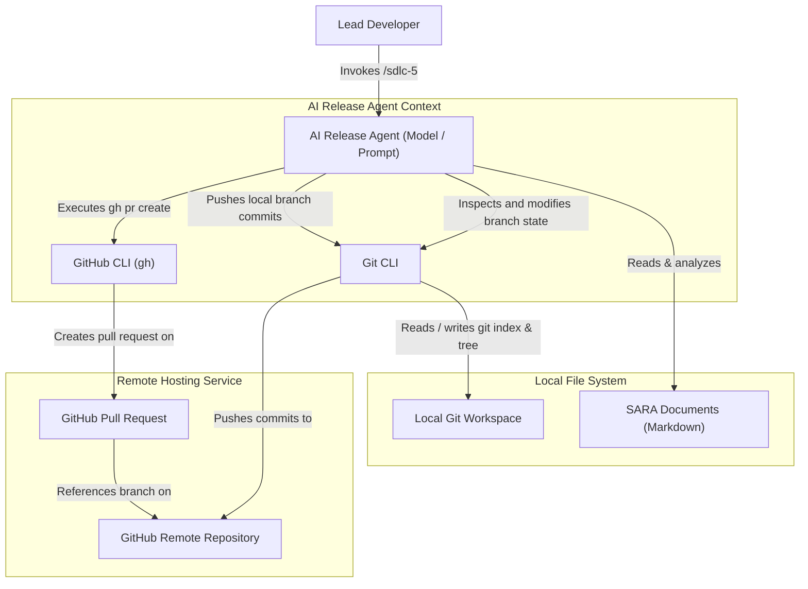

# SYSARCH-501: Phase 5 Release Automation System Architecture

## 1. System C4 Component Diagram

## 2. Bounded Contexts and Domain-Driven Design (DDD)

### 2.1 Bounded Contexts
- **Local Repository Context**: Encompasses the local git workspace state, untracked/staged files, local branch hierarchy, and the commit log.
- **Remote Repository Context**: Represents the remote hosting platform (GitHub), containing upstream branches and registered Pull Requests.
- **Commit Translation Context**: The domain responsible for analyzing git diff structures and generating Conventional Commit messages mapped to actor-action specifications.

### 2.2 CQRS Separation
- **Queries (Read-Only Operations)**:
  - Querying the current branch name (`git branch --show-current`).
  - Checking the status of untracked and modified files (`git status`).
  - Retrieving the cached changes staged in the index (`git diff --cached`).
- **Mutations (State-Changing Operations)**:
  - Creating and checking out a new feature branch (`git checkout -b <branch>`).
  - Staging modified files (`git add .`).
  - Committing changes with the generated commit message (`git commit -m`).
  - Pushing changes to the upstream remote (`git push -u origin <branch>`).
  - Creating a pull request on the remote host (`gh pr create`).

### 2.3 Domain Events
- `BranchInspected`: Fired after identifying the active branch name.
- `BranchCreated`: Fired when a new feature branch has been initialized and checked out.
- `ChangesStaged`: Fired when local file changes are added to the Git index.
- `DiffAnalyzed`: Fired when staged diffs are processed to determine the scope and components.
- `CommitCreated`: Fired when a conventional actor-action commit is created.
- `BranchPushed`: Fired when local branch commits are pushed to the remote repository.
- `PullRequestOpened`: Fired when the pull request is successfully opened on GitHub.

## 3. Storage Design
The primary storage system is the **Local Git Repository** and **VCS Index**. No relational database is required. The system persists:
- Staged changes in the Git index database (`.git/index`).
- Branch references in `.git/refs/`.
- Conventional commit history in the Git commit tree.

## 4. Architectural Tactics & Security Safeguards

### 4.1 Security & Command Injection Protection
- **Branch Name Sanitization**: The input for a new feature branch name must be sanitized to strip whitespace, semicolons, shell pipes, or redirection operators to prevent shell injection.
- **Safe CLI Invocation**: Arguments passed to `git` and `gh` must be encapsulated cleanly within standard exec arrays rather than unescaped shell strings.

### 4.2 Scoped Performance
- **Cached Diff Resolution**: The diff analyzer must isolate its scope using `git diff --cached` to avoid parsing unstaged files or re-scanning the entire monorepo filesystem.

### 4.3 Availability & Reliability (Protected Branch Safeguard)
- **Branch Safety Gate**: The system must explicitly block commits and pushes to protected branches (`main`, `master`) by checking the current branch. If a violation is detected, it must halt and prompt for checkout.
