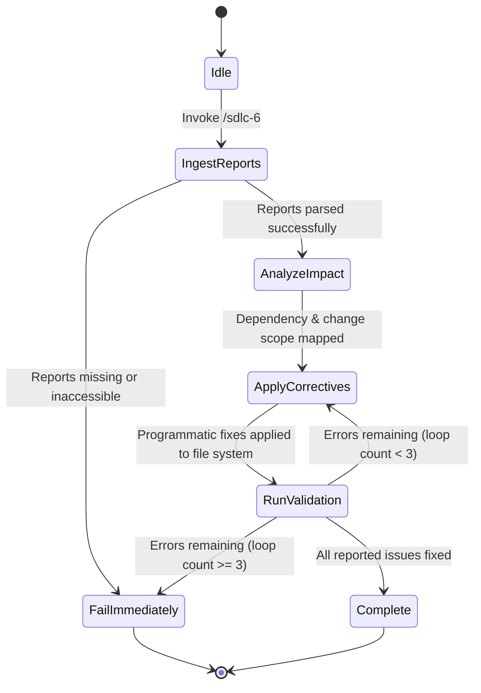

# SWDD-601: Phase 6 Maintenance Detailed Design

## 1. FSM State Transitions
The troubleshooting agent executes using a finite state machine (FSM) to ensure that repairs are made safely, without side effects, and are validated properly:



## 2. Ingestion Details
- **Build Errors**: Extracted by searching for typescript error patterns `TS\d+:` and ESLint error patterns.
- **SonarQube Code Smells**: Map file path, line number, and rule key (e.g., `sonar/no-duplicate-string`).
- **MegaLinter Warnings**: Map style/formatting issues and rule violations.

## 3. Corrective Subroutines

### 3.1 Subroutine: duplicate-string-resolver
1. **Search**: Find all duplicate string literals flagged by `sonar/no-duplicate-string`.
2. **Extraction**:
   - For file-scoped duplicates, define a module constant:
     ```typescript
     const MY_DUPLICATE_STRING = "target string content";
     ```
   - For cross-file duplicates in tests, check if `test-constants.ts` exists in the local package. If not, create it. Export the constant:
     ```typescript
     export const TEST_STRINGS = {
       MY_DUPLICATE_STRING: "target string content",
     } as const;
     ```
3. **Replacement**: Replaces the inline string literals with references to the constant.

### 3.2 Subroutine: type-loosening-resolver
1. **Identify**: Find type violations or linter warnings in test files.
2. **Inject Comment**: Insert the specific ESLint bypass comment directly above the violating line:
   ```typescript
   // eslint-disable-next-line @typescript-eslint/no-unsafe-argument
   myFunction(unsafeArg as any);
   ```
3. **Cast**: Loosen the argument using `as any` or `as unknown as Record<string, any>` if simple comments do not resolve compiler checks.

### 3.3 Subroutine: constructible-mock-formatter
1. **Identify**: Detect classes defined inline inside test files that violate `max-classes-per-file` or cause hoisting errors during Vitest mocking.
2. **Refactor Mock**:
   - Extract the mock class into a separate file under a local `__mocks__` or `test-utils/` directory.
   - Import the mock class at the top of the test file (before any `vi.mock` calls) to prevent Vitest hoisting errors.
   - Enforce explicit accessibility modifiers (`public`/`private`/`protected`) for all constructor parameters, properties, and methods in the mock class:
     ```typescript
     export class MockService {
       private isMocked: boolean;
       public constructor() {
         this.isMocked = true;
       }
       public performAction = () => {
         return this.isMocked;
       };
     }
     ```
   - All methods MUST use arrow function syntax to preserve lexical context.
