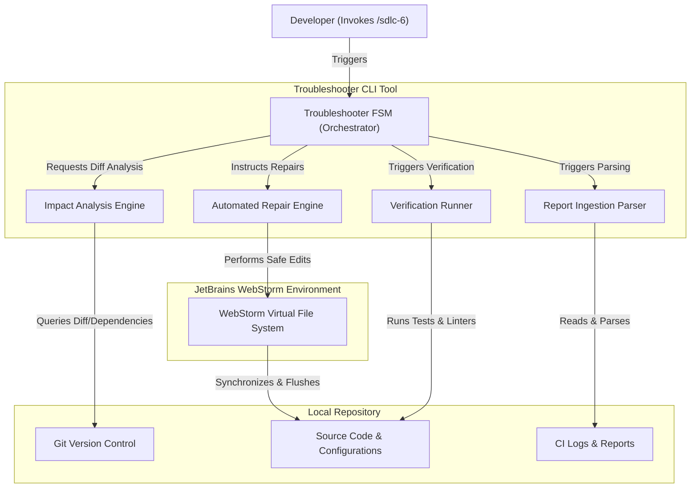

# SYSARCH-601: Maintenance and Troubleshooting Architecture

## 1. System Components
The Phase 6 Maintenance and Troubleshooting agent skill consists of five main architectural components coordinated by a central Finite State Machine (FSM):

## 2. Bounded Contexts and Domain-Driven Design (DDD)

### 2.1 Bounded Contexts
- **CI Report Ingest Context**: Responsible for loading and translating external build logs (GitHub Actions), lint logs (MegaLinter), and duplication metrics (SonarQube) into an internal representation of errors.
- **Dependency Mapping Context**: Resolves target file boundaries, maps containing packages, and traverses workspace dependencies to establish the change scope.
- **Automated Fix Context**: Encapsulates specific subroutines for safe code modifications (e.g. constant hoisting, typecasting, adding eslint comments).

## 3. Storage Design
- The agent manages its own transient storage dynamically using simple local JSON file states or memory caches.
- No structured relational schema or migrations are required.
- Cached files are persisted temporarily under the workspace `.junie/reports/` directory.

## 4. Architectural Tactics
- **Fail-Fast Safeguard**: The system immediately halts with an exit code of `1` if report ingestion fails or reports are missing, protecting against running troubleshooting on partial or invalid data.
- **VFS Alignment**: All file writes are routed through WebStorm Virtual File System integrations to ensure file buffers and indexes remain fully synchronized, preventing stale file locks.
- **Path Traversal Guard**: Prior to executing any VFS file edits, paths are resolved using strict boundaries, validating that no operations are executed outside the workspace root directory.
- **Selective Isolation**: Instead of validating the entire monorepo, verification tasks (linter, test suites) are targeted using package-level filtering to reduce execution time and avoid collateral build noise.
