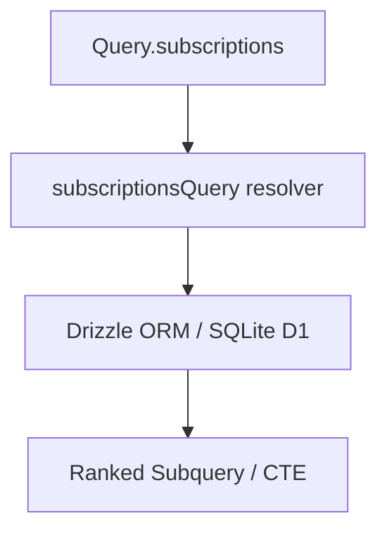

# Software Implementation: GraphQL Resolvers and SQL Pagination Design

## Overview

This implementation adds a `sortBy` argument to the `subscriptions` query in the GraphQL schema, enabling users to sort their feed subscriptions either by the feed's title or by the publication date (`publishedAt`) of the most recent article within each feed. Since the list is paginated via cursors (`after`), sorting on non-unique or dynamic columns requires using compound cursors (e.g. `[sortValue, id]`) to maintain pagination stability and avoid missing/duplicate items.

## Static View (Structure)



## Dynamic View (Logic)

### Compound Cursors
A compound cursor is constructed as a base64 encoded string containing a JSON array:
- `title` sorting: `["Feed Title", "subscription-id"]`
- `publishedAt` sorting: `["2026-06-15T20:00:00.000Z", "subscription-id"]`

### SQLite CTE/Subquery approach for aggregated fields
To sort by `publishedAt` of the most recent article, we build a subquery that groups by `subscriptionsTable.id` and computes the max article `publishedAt`, coalescing nulls to:
- `1970-01-01T00:00:00.000Z` in `DESC` sort (sorting empty feeds last)
- `9999-12-31T23:59:59.999Z` in `ASC` sort (sorting empty feeds last)

This subquery is then filtered in the outer query using compound cursor comparisons:
```typescript
// DESC sorting cursor condition:
or(
  lt(subquery.sortValue, lastSortValue),
  and(
    eq(subquery.sortValue, lastSortValue),
    lt(subquery.id, lastId)
  )
)
```

## Interface & API Definitions

- `subscriptionsQuery(database)`: The resolver factory for the subscriptions list.
- `sortBy` parameter:
  - `field`: `TITLE` | `PUBLISHED_AT`
  - `direction`: `ASC` | `DESC`

## Error Handling & Edge Cases

- **Feeds with No Articles**: Coalesced to minimum/maximum date boundaries depending on direction to ensure they are always sorted last.
- **Invalid Cursor Decode**: If base64 decoding fails or doesn't match the expected format, it will fallback to starting from the beginning.