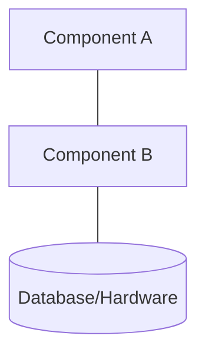
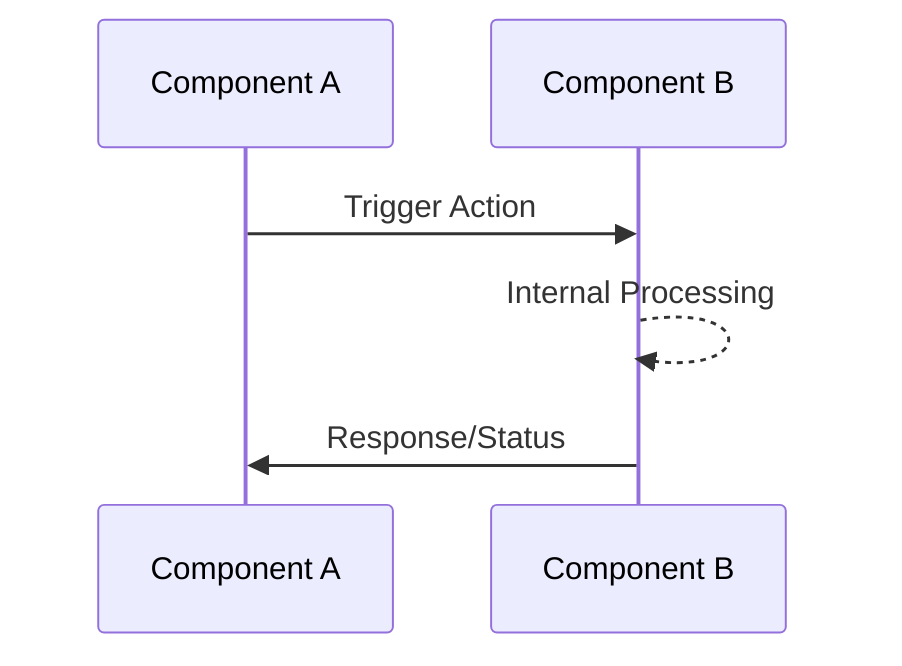

# Architecture: GraphQL and Drizzle Integration Architecture

## Technical Strategy

[One or two sentences explaining how this architecture satisfies the requirements on the Cloudflare Workers & Drizzle ORM SQLite platform.]

## Static View (Structure)

[Description of the physical or logical partitioning of the system.]

## Dynamic View (Behavior)

[Sequence of interactions between components to fulfill a specific function.]

